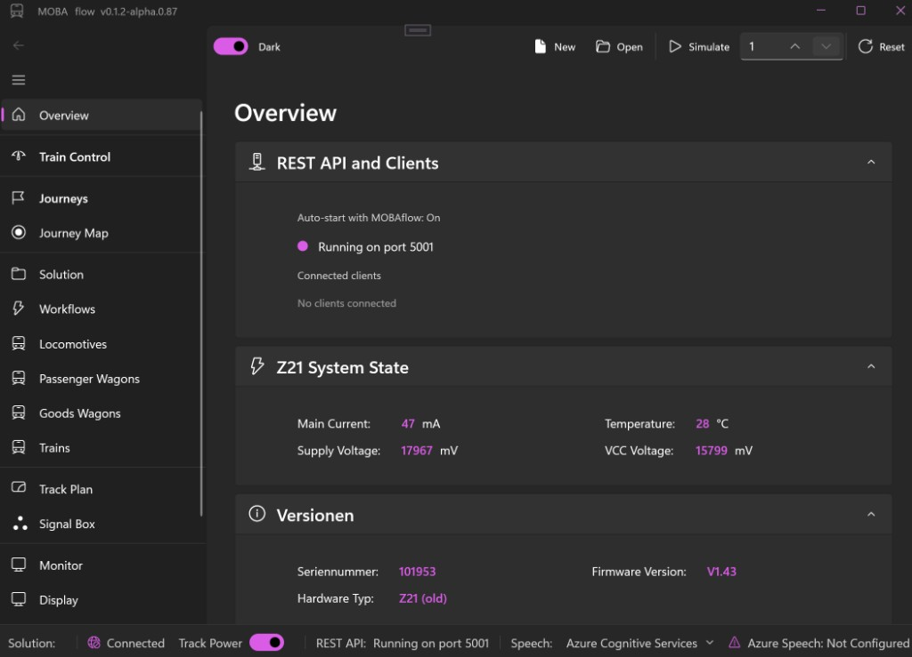
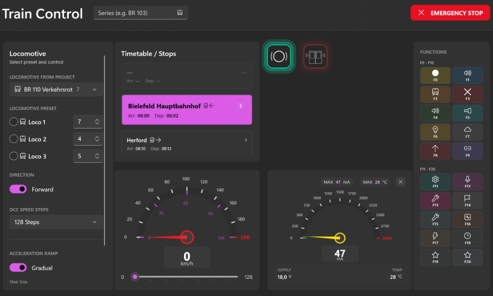
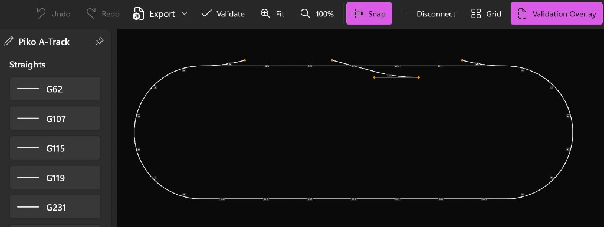
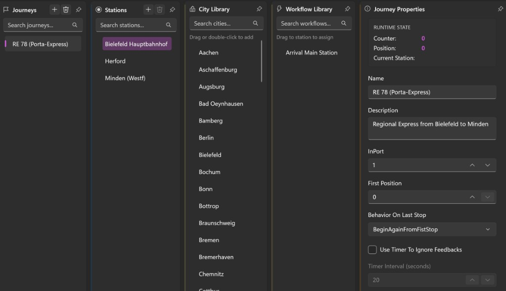
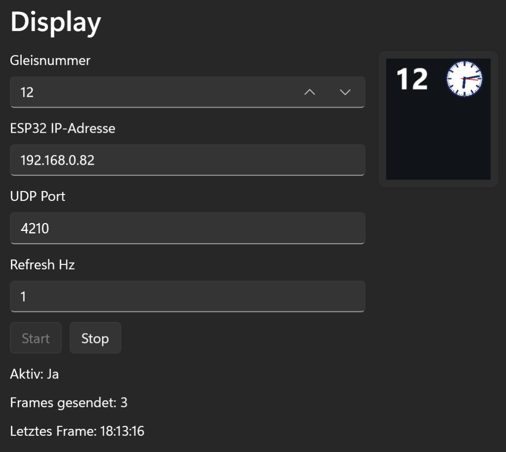

# MOBAflow

**MOBAflow** is an event-driven automation solution for model railroads.
The system enables complex workflow sequences, train control with station
announcements, and real-time feedback monitoring via direct UDP connection to
the Roco Z21 Digital Command Station.

> ⚖️ **Legal Notice:** MOBAflow is an independent open-source project.
> See [THIRD-PARTY-NOTICES.md](docs/THIRD-PARTY-NOTICES.md) for details on
> third-party software, formats, and trademarks (AnyRail, Piko, Roco).

---

## 📑 Table of Contents

- [✨ Features](#-features)
- [📸 Screenshots](#-screenshots)
- [⚠️ Hardware & Safety](#️-hardware--safety)
- [🚀 Quick Start](#-quick-start)
  - [Prerequisites](#prerequisites)
  - [Clone & Build](#clone--build)
  - [Run Applications](#run-applications)
- [🔐 Trust Model & Signatures](#-trust-model--signatures)
- [🔧 Configuration](#-configuration)
- [🛤️ Track Plan](#️-track-plan)
- [🎵 Audio Library](#-audio-library)
- [🎨 Control Libraries](#-control-libraries)
- [📦 Architecture](#-architecture)
- [🔧 Setup Scripts (For Teams)](#-setup-scripts-for-teams)
- [📚 Documentation](#-documentation)

---

## ✨ Features

- 🚂 **Z21 Direct UDP Control** – Real-time communication with Roco Z21
- 🎯 **Journey Management** – Define train routes with multiple stations
- 🧭 **Flexible Layout** – Toggle City and Workflow libraries to maximize workspace
- 🔊 **Text-to-Speech** – Azure Cognitive Services & Windows Speech API
- ⚡ **Workflow Automation** – Event-driven action sequences
- 🎨 **Visual Track Plan** – Drag & drop track editor with snap-to-connect
- 🟢 **Win2D GPU Rendering** – High-performance track visualization
- 🛤️ **Track Libraries** – Extensible support (Piko A-Gleis, Roco Line,
  Tillig, Märklin)
- 📱 **Multi-Host** – MOBAflow (Windows), MOBAsmart (Android), MOBApi (REST)
- 🟢 **Status Monitoring** – Real-time startup progress with log streaming

---

## 📸 Screenshots

A visual tour of MOBAflow's main features. Click any image to view it in full
resolution.

<!--
  Add new screenshots to docs/images/ (PNG, optimized via tinypng.com,
  target width ~1280 px). Use descriptive, kebab-case filenames and keep
  alt texts meaningful for accessibility.
-->

### 🪟 MOBAflow Desktop (WinUI)

<p align="center">
  <a href="docs/images/mobaflow-overview.png">
    
  </a>
  <br />
  <em>Main window – live Z21 status, active journeys and feedback monitoring.</em>
</p>

### 🎛️ Train Control

<p align="center">
  <a href="docs/images/train-control.png">
    
  </a>
  <br />
  <em>Locomotive presets, live timetable, speed &amp; current dials and F0–F20 function keys.</em>
</p>

### 🛤️ Visual Track Plan Editor

<p align="center">
  <a href="docs/images/trackplan-editor.png">
    
  </a>
  <br />
  <em>Drag &amp; drop track editor with snap-to-connect and Win2D rendering.</em>
</p>

### 🎯 Journey Management

<p align="center">
  <a href="docs/images/journey-management.png">
    
  </a>
  <br />
  <em>Compose journeys from stations, cities and workflows with live runtime state.</em>
</p>

### 🖥️ ESP32 Remote Display

<p align="center">
  <a href="docs/images/display-page.png">
    
  </a>
  <br />
  <em>Stream track numbers and live clock via UDP to an ESP32-based remote display.</em>
</p>

---

> 📚 **Need Help?** Check out our comprehensive [**Wiki Documentation**](docs/wiki/INDEX.md)
>
> - [WinUI User Guide](docs/wiki/MOBAFLOW-USER-GUIDE.md) – Learn how to use MOBAflow
> - [Azure Speech Setup](docs/wiki/AZURE-SPEECH-SETUP.md) – Configure text-to-speech
> - [Installation Guide](docs/wiki/INSTALLATION.md) – Set up MOBAflow,
>   MOBApi and MOBAsmart

---

## ⚠️ Hardware & Safety

MOBAflow controls model train layouts via UDP communication with the
**Roco Z21 Digital Command Station**.

### ⚠️ Important Safety Information

> **Before using MOBAflow, please read:**
> 📖 [`HARDWARE-DISCLAIMER.md`](docs/HARDWARE-DISCLAIMER.md)
>
> This document covers:
>
> - ✅ Safety requirements and prerequisites
> - ✅ Network configuration
> - ✅ Liability & disclaimer
> - ✅ Emergency procedures

**Current Status:** ℹ️ *Azure App Configuration setup scripts are available.
Hardware setup, device pairing, and layout integration are still manual.*

---

## 🚀 Quick Start

### Prerequisites

- ✅ [.NET 10 SDK](https://dotnet.microsoft.com/download/dotnet/10.0) matching [`global.json`](global.json)
- ✅ [Visual Studio 2026](https://visualstudio.microsoft.com/) (recommended)
  or VS Code
- ✅ Roco Z21 Digital Command Station (for Z21 connectivity)

### Clone & Build

```bash
git clone https://github.com/ahuelsmann/MOBAflow.git
cd MOBAflow
dotnet restore MOBAflow/MOBAflow.csproj
dotnet build MOBAflow/MOBAflow.csproj
```

**Cross-platform subset (library and backend projects only):**

```bash
dotnet restore Backend/Backend.csproj
dotnet build Backend/Backend.csproj
dotnet test Test/Test.csproj
```

> Note: On non-Windows systems, the WinUI and MAUI projects are not
> buildable. Restore/build individual `.csproj` files instead of relying on
> solution-level restore. Some `System.Speech` tests are Windows-only.

### Run Applications

**🪟 MOBAflow (Windows Desktop):**

```bash
dotnet run --project MOBAflow/MOBAflow.csproj
```

**🌐 MOBApi (REST API, Port 5001):**

```bash
dotnet run --project MOBApi/MOBApi.csproj
```

MOBApi listens on **port 5001** (all interfaces). It provides the REST API for
the MOBAflow Overview status and for MOBAsmart (client list, health).

You can **start MOBApi in two ways**:

1. **Standalone** – run the command above.
2. **Together with MOBAflow** – enable "Auto-start REST API with MOBAflow"
   in MOBAflow Settings so MOBAflow starts the MOBApi process automatically.

MOBAsmart discovers the server via UDP multicast; ensure PC and phone are on
the same network.

**📱 MOBAsmart (Android):**

```bash
dotnet build MOBAsmart/MOBAsmart.csproj -f net10.0-android
```

**🧪 Run Tests:**

```bash
dotnet test Test/Test.csproj
```

---

## 🔐 Trust Model & Signatures

Official MOBAflow releases are identified by **signed Git tags** in this repository.

- Release versions are tagged as `X.Y.Z` (e.g. `0.1.0`).
- Starting with version `0.1.0`, maintainers sign these tags with their GPG
  keys so you can verify that a given version really comes from us and was not
  modified.

### How to use signed versions as a user

Typical workflow for installing a specific version:

1. **Select a version**: Pick a tag from the GitHub *Tags* / *Releases* list
   (e.g. `0.1.0`).
2. **Fetch tags & verify**:

   ```bash
   git fetch origin --tags
   git tag -v 0.1.0
   ```

   Only continue if GPG reports a **valid signature** from a maintainer key
   listed in `docs/legal/MAINTAINERS.md`.
3. **Check out the tag**:

   ```bash
   git checkout 0.1.0
   ```

4. **Build & run** using the commands from the [Quick Start](#-quick-start) section.

### Verifying a Release Tag

```bash
git fetch origin --tags
git tag -v 1.2.3
```

- Only trust tags whose signature matches one of the maintainer keys
  documented in `docs/legal/MAINTAINERS.md` (e.g. key ID
  `7DAD81238FEE2F49`).
- If verification fails, do **not** use that release and contact the maintainers.

### Maintainer Keys

The current list of GPG keys and fingerprints used for signing release tags
is maintained in:

- `docs/legal/MAINTAINERS.md`

---

## 🔧 Configuration

MOBAflow uses **Azure Cognitive Services Speech** for text-to-speech
announcements. Choose your preferred setup method:

### 🎯 Setup Options

| Method | Best For | Complexity |
| -------- | ---------- | ------------ |
| **A) Azure App Config** | Teams, shared environments | ⭐⭐⭐ |
| **B) User Secrets** | Individual developers | ⭐⭐ |
| **C) Settings UI** | End users, no coding | ⭐ |

---

### Option A: Azure App Configuration (Teams)

> 💡 **For Developer Teams:** Centralized configuration shared across all team members.

**Quick Setup:**

```powershell
# 1. Create Azure resource (once)
.\scripts\setup-azure-appconfig.ps1 -SpeechKey "YOUR-KEY" -SpeechRegion "germanywestcentral"

# 2. Install on all team systems
.\scripts\install-appconfig-connection.ps1 -ConnectionString "YOUR-CONNECTION-STRING"

# 3. Restart IDE
```

📖 **Details:** See [🔧 Setup Scripts](#-setup-scripts-for-teams) section below

---

### Option B: User Secrets (Developers)

**1. Get Azure Speech Key:**

- 🌐 Go to [Azure Portal](https://portal.azure.com)
- ➕ Create: **Cognitive Services** → **Speech**
- 📋 Copy **Key** and **Region**

**2. Configure Secrets:**

```bash
cd MOBAflow
dotnet user-secrets set "Speech:Key" "YOUR-AZURE-SPEECH-KEY"
dotnet user-secrets set "Speech:Region" "germanywestcentral"
```

**3. Verify:** Run the app – speech should work ✅

---

### Option C: Settings UI (End Users)

**1. Launch** MOBAflow  
**2. Navigate:** Settings → Speech Synthesis  
**3. Enter** your Azure Speech Key  
**4. Select** Region (e.g., `germanywestcentral`)  
**5. Click** Save

> ⚠️ **Security:** The key is stored locally in `appsettings.json`.
> Never commit this file to version control.

---

### Configuration Priority

The app loads settings in this order (first found wins):

1. ☁️ **Azure App Configuration** (if `AZURE_APPCONFIG_CONNECTION` env var exists)
2. 🔐 **User Secrets** (Development mode only)
3. ⚙️ **Settings UI** (`appsettings.json`)
4. 🚫 **Fallback:** Speech features disabled

---

## 🛤️ Track Plan

Design your model railroad layout with MOBAflow's visual track planning system.

### ✨ Track Plan Features

- ✅ **Drag & Drop** – Place tracks from toolbox
- ✅ **Snap-to-Connect** – Automatic track joining
- ✅ **Grid Alignment** – Rotation & positioning controls
- ✅ **Theming** – Light & Dark mode support
- ✅ **Navigation** – Zoom & Pan
- ✅ **Feedback Points** – Assign detection sensors
- ✅ **Validation** – Real-time constraint checking
- ✅ **Signal Control** – Requires active Z21 connection
- ✅ **Win2D Rendering** – GPU-accelerated graphics (Phase 1)

### 🛤️ Supported Track Systems

| Library | Status | Description |
| --------- | -------- | ------------- |
| **TrackLibrary.PikoA** | ✅ Active | Piko A-Gleis |
| TrackLibrary.RocoLine | 🚧 Planned | Roco Line |
| TrackLibrary.Tillig | 🚧 Planned | Tillig |
| TrackLibrary.Maerklin | 🚧 Planned | Märklin |

---

## 🎵 Audio Library

Play sound effects in workflows (station bells, train whistles, crossing signals).

### 📂 Directory Structure

```text
Sound/Resources/Sounds/
├── Station/          # Station bells, gongs, platform warnings
├── Train/            # Whistles, horns, brake sounds
├── Signals/          # Warning beeps, crossing bells
└── Ambient/          # Background ambience (optional)
```

### 📋 Requirements

| Property | Value |
| ---------- | ------- |
| **Format** | `.wav` (PCM only) |
| **Sample Rate** | 44100 Hz or 48000 Hz |
| **Bit Depth** | 16-bit |
| **Channels** | Mono or Stereo |
| **Not Supported** | ❌ .mp3, .ogg, .flac |

### 🎯 Naming Conventions

| ✅ Good | ❌ Bad |
| --------- | -------- |
| `arrival_bell.wav` | `sound1.wav` |
| `whistle_short.wav` | `ArrivalBell.wav` |
| `crossing_warning.wav` | `My Sound.wav` |

### 📥 Adding Sounds

1. **Download** from [Freesound.org](https://freesound.org) (CC0 license recommended)
2. **Copy** to appropriate subfolder
3. **Use in Workflow:** Create Audio Action → Set FilePath

### ⚖️ Licensing

- ✅ **CC0 (Public Domain)** – No attribution required
- ✅ **CC-BY 4.0** – Attribution required (add to `ATTRIBUTION.md`)
- ❌ **CC-BY-NC** – Avoid (non-commercial restriction)

📖 **Attribution File:** [`Sound/Resources/Sounds/ATTRIBUTION.md`](Sound/Resources/Sounds/ATTRIBUTION.md)

---

## 🎨 Control Libraries

Platform-specific UI control libraries for consistent, reusable components.

### 🏗️ Architecture

```text
MOBAflow/Controls/       ← WinUI 3 XAML controls inside the desktop app
    ↓
MAUI.Controls/           ← MAUI XAML (Android Mobile)
    ↓
SharedUI/                ← ViewModels (Platform-agnostic)
    ↓
Domain/                  ← Business Models
```

### 📦 Available Libraries

| Project | Platform | Technology | Target |
| --------- | ---------- | ------------ | -------- |
| **MOBAflow/Controls** | Windows | WinUI 3 XAML | Desktop app control set |
| **MAUI.Controls** | Android | .NET MAUI XAML | Mobile control library |
| **SharedUI** | Cross-platform | CommunityToolkit.Mvvm | ViewModels |

### 🪟 Windows Controls in MOBAflow

```xml
<Page xmlns:controls="using:Moba.WinUI.Controls">
    <controls:TrainCard 
        TrainName="ICE 1" 
        Speed="120" 
        IsForward="True" />
</Page>
```

**Guidelines:**

- Use `DependencyProperty` for bindable properties
- Prefer `x:Bind` (compiled bindings)
- Use `ThemeResource` for colors/styles
- Follow Fluent Design System

### 📱 MAUI.Controls (Android)

```xml
<ContentPage xmlns:controls="clr-namespace:Moba.MAUI.Controls;assembly=MAUI.Controls">
    <controls:TrainCard 
        TrainName="ICE 1" 
        Speed="120" 
        IsForward="True" />
</ContentPage>
```

**Guidelines:**

- Use `BindableProperty` for bindable properties
- Use `AppThemeBinding` for Light/Dark mode
- Touch-optimized (minimum 44x44 dp)
- Follow MAUI design patterns

### ⚖️ Platform Differences

| Feature | MOBAflow/Controls | MAUI.Controls |
| --------- | ---------------- | --------------- |
| Bindable Properties | `DependencyProperty` | `BindableProperty` |
| Binding Syntax | `{x:Bind}` | `{Binding}` |
| Base Class | `UserControl` | `ContentView` |
| Icons | `FontIcon` | `FontImageSource` |
| Theming | `ThemeResource` | `AppThemeBinding` |

---

## 📦 Architecture

MOBAflow follows **Clean Architecture** principles with strict layer separation.

### 🏗️ Layer Structure

```text
┌─────────────────────────────────────┐
│  MOBAflow / MOBAsmart / MOBApi      │  ← Platform UI & API
├─────────────────────────────────────┤
│  SharedUI (ViewModels)              │  ← MVVM Layer
├─────────────────────────────────────┤
│  Backend (Services, Logic)          │  ← Business Logic
├─────────────────────────────────────┤
│  Domain (Models, POCOs)             │  ← Core Entities
└─────────────────────────────────────┘
```

### Runtime Boundary (Current Status)

Shared ViewModels talk to the in-process runtime only; there is no separate UI client interface:

```text
MainWindowViewModel / TrainControlViewModel / MauiViewModel
  ↓
IMobaRuntime  (MobaRuntimeService)
  ↓
IZ21 / JourneyManager / WorkflowService
```

Current scope:

- `MainWindowViewModel`, `TrainControlViewModel`, and `MauiViewModel` inject
  `IMobaRuntime` (singleton `MobaRuntimeService`) instead of using `IZ21` or
  `JourneyManager` directly for commands and snapshots
- The runtime publishes `MobaRuntimeSnapshot` (and related events such as
  traffic and feedback) back to the shell
- Project activation is performed inside `MobaRuntimeService.ActivateProjectAsync`,
  which owns `ActiveProjectContext` and a `JourneyManager` per active project
- The active runtime still uses the live `Project` instance from the loaded
  `Solution`; a dedicated runtime copy remains a possible future step
- Shared master data (`data.json`) is held in **`MasterDataStore`** (Backend DI);
  WinUI services expose cities and locomotives to the shell

### 🛠️ Technology Stack

| Layer | Technology |
| ------- | ------------ |
| **Framework** | .NET 10 |
| **UI** | WinUI 3 (MOBAflow), .NET MAUI (MOBAsmart) |
| **API** | ASP.NET Core REST + SignalR (MOBApi) |
| **Graphics** | Microsoft.Graphics.Win2D |
| **MVVM** | CommunityToolkit.Mvvm |
| **Logging** | Serilog (File + In-Memory Sink) |
| **Speech** | Azure Cognitive Services, Windows Speech |
| **Networking** | Direct UDP (Z21 Protocol) |
| **Testing** | NUnit |

### 📄 Solution File Format

MOBAflow uses **System.Text.Json** with schema validation.

#### Schema Version

```json
{
  "name": "My Model Railroad",
  "schemaVersion": 1,
  "projects": [...]
}
```

**Current Schema Version:** `1`

#### Validation Rules

- ✅ **JSON Structure** – Valid syntax
- ✅ **Required Properties** – `name`, `projects`
- ✅ **Schema Version** – Compatibility check
- ✅ **Project Integrity** – Valid structure

### 📊 Logging Infrastructure

**Serilog Configuration:**

- 📁 **File Logs:** `bin/Debug/logs/mobaflow-YYYYMMDD.log` (rolling, 7-day retention)
- 💾 **In-Memory Sink:** Real-time log streaming to MonitorPage UI
- 🔍 **Structured Logging:** Searchable properties
- 📊 **Log Levels:** Debug (Moba), Warning (Microsoft)

**Example:**

```csharp
_logger.LogInformation(
    "Feedback received: InPort={InPort}, Value={Value}",
    inPort,
    value);
```

📖 **Details:** See [`docs/ARCHITECTURE.md`](docs/ARCHITECTURE.md)

---

## 🔧 Setup Scripts (For Teams)

> 💡 **For Developer Teams:** Centralized Azure App Configuration for shared
> environments.
>
> 👤 **For End Users:** Skip this section and use
> [Settings UI](#option-c-settings-ui-end-users) instead.

### 📜 Available Scripts

| Script | Purpose | Run Where |
| -------- | --------- | ----------- |
| `setup-azure-appconfig.ps1` | Create resource | **Once** (any system) |
| `install-appconfig-connection.ps1` | Set env var | **All systems** |

### 🚀 Quick Team Setup

**1. Create Azure Resource:**

```powershell
.\scripts\setup-azure-appconfig.ps1 `
    -SpeechKey "YOUR-KEY" `
    -SpeechRegion "germanywestcentral"
```

**Output:** Copy the Connection String ✅

**2. Install on Team Systems:**

```powershell
.\scripts\install-appconfig-connection.ps1 `
    -ConnectionString "Endpoint=https://...;Id=...;Secret=..."
```

**3. Restart IDE:**

Close and reopen Visual Studio / VS Code

**4. Verify:**

Speech settings automatically load from Azure – no local config needed! ✅

---

### 📖 Script Details

#### setup-azure-appconfig.ps1

**Purpose:** Creates Azure App Configuration resource

**Parameters:**

- `-SpeechKey` (required) – Azure Speech API Key
- `-SpeechRegion` (required) – Azure region
  (e.g., `germanywestcentral`)
- `-ResourceGroupName` (optional) – Default: `MOBAflow-RG`
- `-ConfigStoreName` (optional) – Default: `mobaflow-config`
- `-Location` (optional) – Default: `germanywestcentral`

**Requirements:**

- Azure CLI installed
- Logged in (`az login`)
- Subscription selected (`az account set`)

---

#### install-appconfig-connection.ps1

**Purpose:** Sets `AZURE_APPCONFIG_CONNECTION` environment variable

**Parameters:**

- `-ConnectionString` (required) – From previous script output

**Requirements:**

- Run as normal user (not Admin)
- Restart IDE after running

---

### ✅ Benefits

- ✅ Centralized configuration for entire team
- ✅ No `appsettings.json` commits
- ✅ Easy key rotation (update once in Azure)
- ✅ Consistent config on CI/CD pipelines

---

## 📚 Documentation

### 📖 Core Documentation

**Location:** `docs/`

| Document | Description |
| ---------- | ------------- |
| [ARCHITECTURE.md](docs/ARCHITECTURE.md) | Architecture & design patterns |
| [CHANGELOG.md](docs/CHANGELOG.md) | Version history & release notes |
| [SECURITY.md](docs/SECURITY.md) | Security policy & reporting |
| [CODE_OF_CONDUCT.md](CODE_OF_CONDUCT.md) | Community conduct guidelines |
| [JSON-VALIDATION.md](docs/JSON-VALIDATION.md) | Solution JSON validation |
| [MINVER-SETUP.md](docs/MINVER-SETUP.md) | MinVer versioning setup |
| [HARDWARE-DISCLAIMER.md](docs/HARDWARE-DISCLAIMER.md) | Hardware safety & liability |
| [THIRD-PARTY-NOTICES.md](docs/THIRD-PARTY-NOTICES.md) | Third-party licenses |
| [CURSOR-AZURE-DEVOPS-MCP.md](docs/CURSOR-AZURE-DEVOPS-MCP.md) | Azure DevOps MCP integration |
| [CLAUDE.md](docs/CLAUDE.md) | AI assistant instructions |
| [CLA.md](docs/legal/CLA.md) | Contributor License Agreement (CLA) |

### 📚 Wiki (User & Feature Guides)

**Location:** `docs/wiki/`

| Guide | Description |
| ------- | ------------- |
| [INDEX.md](docs/wiki/INDEX.md) | Wiki index & platform overview |
| [INSTALLATION.md](docs/wiki/INSTALLATION.md) | Installation & setup guide |
| [MOBAFLOW-USER-GUIDE.md](docs/wiki/MOBAFLOW-USER-GUIDE.md) | WinUI desktop app user guide |
| [MOBASMART-USER-GUIDE.md](docs/wiki/MOBASMART-USER-GUIDE.md) | MOBAsmart Android app user guide |
| [MOBASMART-WIKI.md](docs/wiki/MOBASMART-WIKI.md) | Detailed MOBAsmart documentation |
| [AZURE-SPEECH-SETUP.md](docs/wiki/AZURE-SPEECH-SETUP.md) | Azure Speech setup |
| [QUICK-START-TRACK-STATISTICS.md](docs/wiki/QUICK-START-TRACK-STATISTICS.md) | Track statistics quick start |
| [VIESSMANN-SIGNAL-MAPPING.md](docs/wiki/VIESSMANN-SIGNAL-MAPPING.md) | Viessmann signal mapping |
| [MOBATPS.md](docs/wiki/MOBATPS.md) | MOBAtps track plan system architecture |

---

## 📄 License

This project is licensed under the **MIT License**.
See [LICENSE](LICENSE) for details.

---

Made with ❤️ for model railroad enthusiasts.
