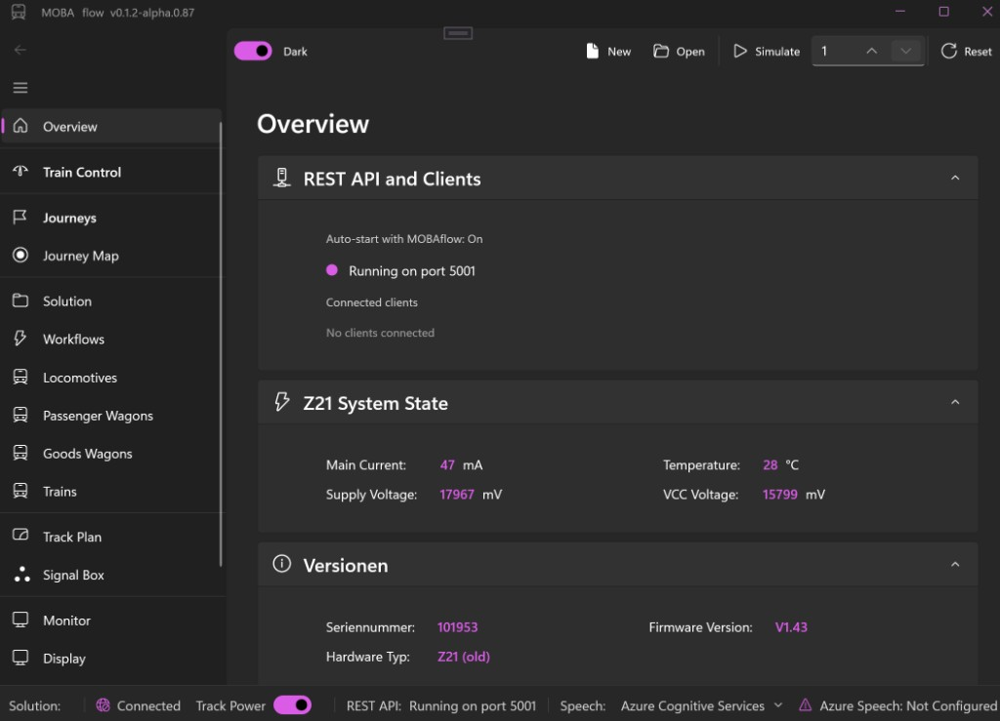
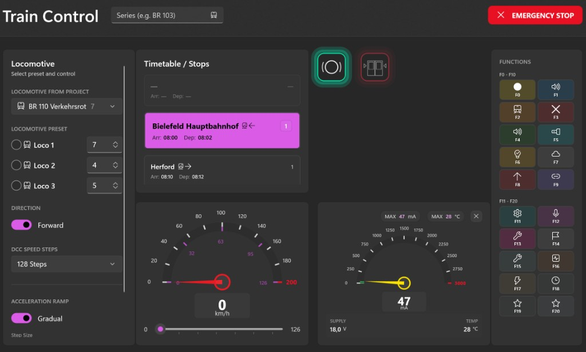
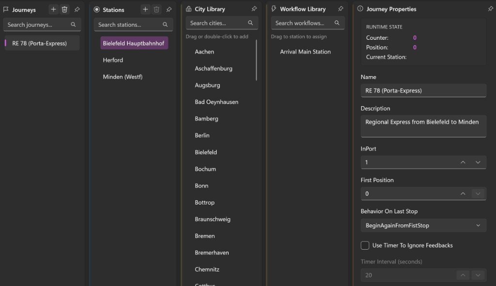
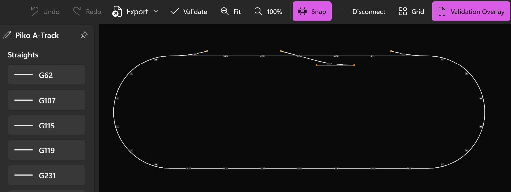
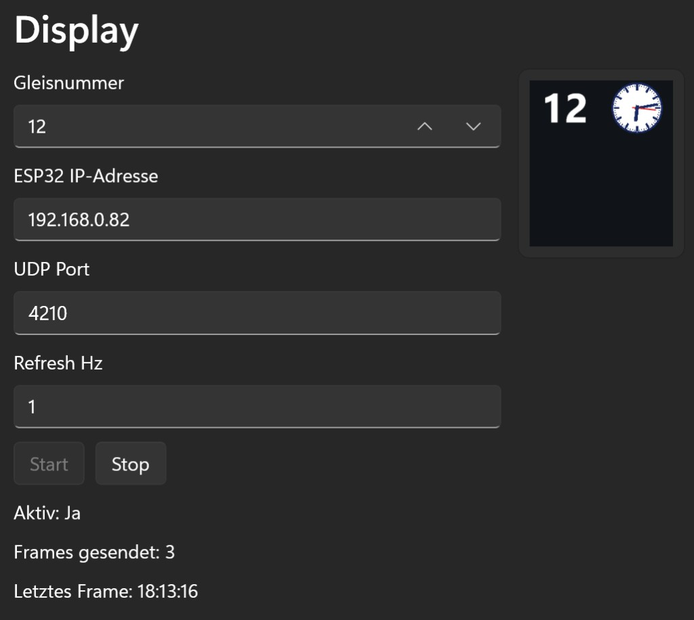

<div align="center">

# MOBAflow

### Bring your model railroad to life

Control trains, plan journeys and turn layout feedback into automated actions.
Built for Roco Z21, with a Windows control center and an Android companion.

[](LICENSE)
[](#mobaflow-desktop)
[](#mobasmart)
[](https://github.com/ahuelsmann/MOBAflow/actions/workflows/quality.yml)

[Get started](#get-started) ·
[Features](#features) ·
[Screenshots](#screenshots) ·
[User guides](docs/wiki/INDEX.md) ·
[Website](https://ahuelsmann.github.io/MOBAflow/) ·
[MOBAnews](https://mobaflow-fortschritt.ahuelsmann1177.chatgpt.site)

<a href="docs/images/mobaflow-overview.png">
  
</a>

</div>

MOBAflow is an open-source model railroad control and automation project. Drive
locomotives from your PC or phone, organize your rolling stock, and define what
happens when a train reaches a feedback point. Reusable workflows connect those
events to commands, station announcements, signal changes and journey progress.

**Development status:** MOBAflow is working toward its first stable release.
The current focus is completing and stabilizing the existing features. It is
available as source code and version tags; ready-to-install GitHub release
packages are not yet published. Features labelled **Preview** in the desktop
navigation are available for testing and may change.

## Features

| What you want to do | How MOBAflow helps |
| --- | --- |
| Drive your trains | Control locomotive speed, direction and functions F0–F31 through the Z21 |
| Automate layout events | Assign reusable workflows to feedback-point counts in the Event Manager |
| Plan journeys | Organize ordered stations, follow progress in the Journey Map and change stops through workflow actions |
| Manage rolling stock | Keep locomotives, wagons, train consists, photos and decoder records together; print locomotive passports |
| Build a track plan | Import from AnyRail or arrange Piko A track pieces with snapping, topology validation, Undo/Redo and SVG export |
| Operate a signal box | Work with signals, switches and routes, including Viessmann multiplex signals |
| Add sound | Play WAV effects and generate local announcements with Piper TTS or Windows Speech |
| Monitor your layout | Inspect Z21 traffic, feedback, track power and live telemetry |
| Explore timetable operation | Test dated services, delays, conflict explanations and dispatcher decisions in the preview Timetable page |
| Experiment with displays | Design 5×5 matrix images and test the evolving ESP32-S3 display integration |

### How automation works

A feedback point reports a train passing. MOBAflow counts accepted activations
and checks the event rules of active journeys. When a configured count matches,
it runs the assigned workflow—for example, playing a station announcement,
setting a signal aspect or advancing the journey to its next stop.

Workflows are ordered action lists with optional delays. The editor provides
validation, a dry-run mode and execution traces to help you understand each run.
You control how a journey continues: a workflow at its final stop can point
back to the first stop, while resetting feedback counters or adjusting event
counts during an active journey lets you prepare the next cycle. This makes
repeated journeys part of your event and workflow setup.

## The apps

### MOBAflow Desktop

The **Windows control center**, built with WinUI 3, brings layout editing,
train control and monitoring into one application. Create your project, manage
rolling stock, plan journeys and configure event-driven workflows. Track plans,
the signal box and diagnostic views keep the layout's configuration and live
state close at hand.

[MOBAflow user guide](docs/wiki/MOBAFLOW-USER-GUIDE.md)

### MOBAsmart

The **Android companion**, built with .NET MAUI, puts train control beside the
layout. Connect directly to the Z21 to drive locomotives, count laps and monitor
track power. Connect to MOBAflow through MOBApi to synchronize the locomotive
fleet, signal-box plan and runtime state, or capture and upload rolling-stock
photos to the desktop library.

[MOBAsmart user guide](docs/wiki/MOBASMART-USER-GUIDE.md)

### MOBApi

The **local API** connects MOBAflow, MOBAsmart and other integrations through
REST endpoints and SignalR updates. It shares project data, runtime snapshots,
journey progress and photos, and relays remote commands to the desktop runtime.
MOBAflow can start it automatically, or it can run as a separate process.
MOBAsmart discovers it on the same LAN and supports QR-code pairing.

MOBApi is a bridge to the desktop runtime, not a standalone layout controller.

### Remote displays

**MOBAdisplay** provides RGB565 rendering, a versioned UDP transport and
PlatformIO firmware for ESP32-S3 displays. The desktop **ESP32 Display** page
connects to a configured device, checks its capabilities and offers supported
test commands and health diagnostics.

This integration is still evolving: the destination-display workflow action
currently skips output when no display service is configured, and no production
service is wired into the default handler yet. The older Arduino sketch is a
standalone hardware color test.

[Display architecture and current limitations](docs/PROJECT-REFERENCE.md#display-pipeline)

## Screenshots

<table>
  <tr>
    <td><a href="docs/images/train-control.png"></a></td>
    <td><a href="docs/images/journey-management.png"></a></td>
  </tr>
  <tr>
    <td align="center"><strong>Train control</strong></td>
    <td align="center"><strong>Journey management</strong></td>
  </tr>
  <tr>
    <td><a href="docs/images/trackplan-editor.png"></a></td>
    <td><a href="docs/images/display-page.png"></a></td>
  </tr>
  <tr>
    <td align="center"><strong>Track plan</strong></td>
    <td align="center"><strong>Remote displays</strong></td>
  </tr>
</table>

## Get started

### Requirements

| Component | What you need |
| --- | --- |
| Desktop development | A Windows x64 PC, the .NET SDK selected by [global.json](global.json), and Visual Studio with the workloads in [.vsconfig](.vsconfig), or equivalent command-line tooling |
| Android development | The .NET MAUI Android workload and an Android 8.0 / API 26 or newer device or emulator |
| Live layout operation | A reachable Roco Z21 and a trusted private LAN; feedback modules for feedback-driven automation |

MOBAflow uses .NET 10. The desktop targets `net10.0-windows10.0.22621.0`;
MOBAsmart targets `net10.0-android`. See the
[installation guide](docs/wiki/INSTALLATION.md) for platform setup, mobile
pairing and troubleshooting.

### Build the Windows app

Clone the repository and open [Moba.slnx](Moba.slnx) in Visual Studio, or run
these commands on Windows with the required tooling installed:

```powershell
git clone https://github.com/ahuelsmann/MOBAflow.git
cd MOBAflow

dotnet restore MOBAflow/MOBAflow.csproj
dotnet build MOBAflow/MOBAflow.csproj
```

The normal desktop build also builds and copies MOBApi. When you are ready to
start the app:

```powershell
dotnet run --project MOBAflow/MOBAflow.csproj
```

### Connect your layout

1. Read the [hardware and liability notes](docs/HARDWARE-DISCLAIMER.md).
2. In **Settings**, confirm the Z21 IP address and UDP port (`21105` by default).
3. Create a solution or open the included sample, then select a project.
4. Connect to the Z21 and verify feedback and telemetry in **Overview** or
   **Monitor** before operating trains.
5. To add MOBAsmart, follow the [Android setup and pairing steps](docs/wiki/INSTALLATION.md#first-android-start).

Keep the PC, Z21 and phone on the same trusted private LAN. Guest Wi-Fi,
client isolation and firewall rules can prevent discovery or communication.

## Documentation and progress

| Looking for… | Start here |
| --- | --- |
| Installation and troubleshooting | [Setup guide](docs/wiki/INSTALLATION.md) |
| App instructions | [User documentation](docs/wiki/INDEX.md) |
| Local speech synthesis | [Piper TTS setup](docs/wiki/PIPER-TTS-SETUP.md) |
| Architecture and implementation details | [Architecture](docs/ARCHITECTURE.md) · [Project reference](docs/PROJECT-REFERENCE.md) |
| Planned work and current status | [Roadmap](plans/ROADMAP.md) · [Public Kanban](https://github.com/users/ahuelsmann/projects/1) · [Issues](https://github.com/ahuelsmann/MOBAflow/issues) |
| Version history | [Tags](https://github.com/ahuelsmann/MOBAflow/tags) · [Changelog](CHANGELOG.md) |
| A quick look at recent development | [MOBAnews](https://mobaflow-fortschritt.ahuelsmann1177.chatgpt.site) |

## Contributing

Bug reports, documentation improvements and code contributions are welcome.
Start with [CONTRIBUTING.md](CONTRIBUTING.md) for the development workflow,
validation requirements and contributor agreement. Submit changes through a
pull request.

For AI-assisted development, also read [AGENTS.md](AGENTS.md) and the
[AI development guide](docs/AI-DEVELOPMENT.md). Build and test instructions,
repository skills and task-specific guidance live there.

## Safety and network scope

MOBAflow sends commands to real model railroad hardware. Read the
[hardware and liability notes](docs/HARDWARE-DISCLAIMER.md) before operating
your layout.

MOBAflow, MOBAsmart and MOBApi are intended for a **trusted private LAN** and
must not be exposed to the public internet. Reads remain available without
credentials, and every remote command is validated before it reaches MOBAflow.
Because MOBAflow targets a private household, the remaining authentication and
pairing are being removed ([#165](https://github.com/ahuelsmann/MOBAflow/issues/165)).
See the [current security status](docs/PROJECT-REFERENCE.md#mobapi-endpoints)
for details.

## License

MOBAflow is available under the [MIT License](LICENSE). It is an independent
open-source project; product names and trademarks belong to their respective
owners. See the [third-party notices](docs/THIRD-PARTY-NOTICES.md).
