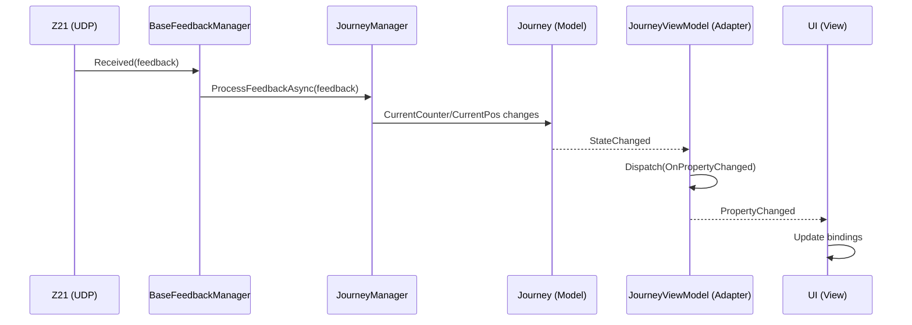
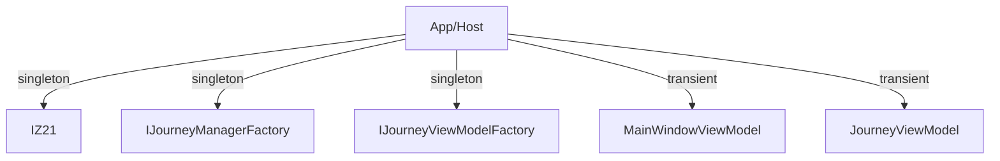
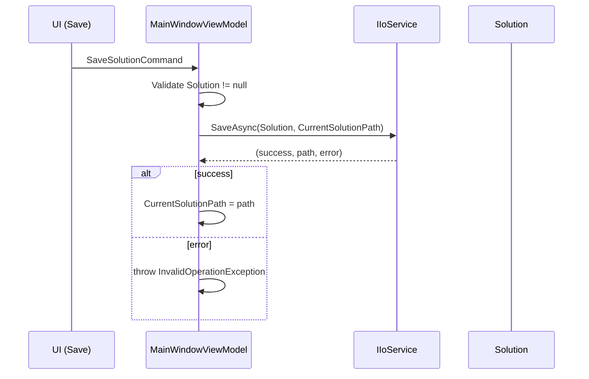

# Architecture Overview

- Backend remains platform-independent (no UI thread dispatching).
- SharedUI holds base ViewModels and thin platform adapters in subfolders:
  - `SharedUI/ViewModel/WinUI`
  - `SharedUI/ViewModel/MAUI`
- Platform projects (WinUI, MAUI, WebApp) wire DI and factories:
  - IZ21, IJourneyManagerFactory as backend services
  - IJourneyViewModelFactory to instantiate platform-specific JourneyViewModel adapters

## Dependency Injection

- Register backend services as singletons in platform apps
- ViewModels are transient and resolved in views/windows
- Tree building uses a per-platform IJourneyViewModelFactory
- Factory interfaces (IJourneyManagerFactory, IJourneyViewModelFactory) decouple creation from consumers and enable testing/mocking → recommended with DI

## Sequence: Feedback to UI



## DI Graph (Mermaid)



## Sequence: Save Solution



## Sequence: Load Solution

```mermaid
sequenceDiagram
    participant UI as UI (Load)
    participant VM as MainWindowViewModel
    participant IO as IIoService
    participant Sol as Solution

    UI->>VM: LoadSolutionCommand
    VM->>IO: LoadAsync()
    IO-->>VM: (solution, path, error)
    alt solution available
        VM->>VM: Solution = solution; CurrentSolutionPath = path
        VM->>VM: BuildTreeView()
    else error
        VM->>VM: throw InvalidOperationException
    end
```

## Rules

- No platform deps in Backend
- No `new` of services in UI; resolve from DI
- Platform adapters only dispatch/wire services

