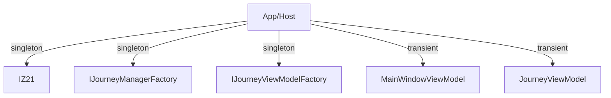
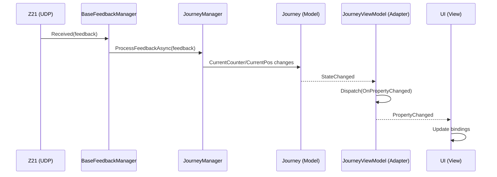
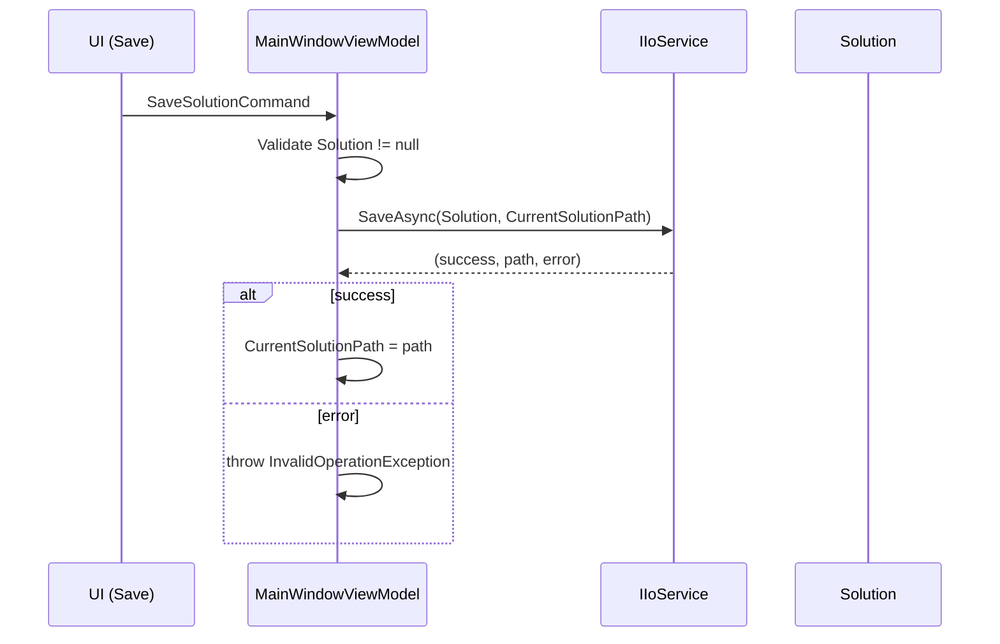

# Architecture Overview

- Backend remains platform-independent (no UI thread dispatching).
- SharedUI holds base ViewModels and thin platform adapters in subfolders:
  - `SharedUI/ViewModel/WinUI`
  - `SharedUI/ViewModel/MAUI`
- Platform projects (WinUI, MAUI, WebApp) wire DI and factories:
  - IZ21, IJourneyManagerFactory as backend services
  - IJourneyViewModelFactory to instantiate platform-specific JourneyViewModel adapters

## Dependency Flow
```
WinUI → SharedUI → Backend
MAUI → SharedUI → Backend
WebApp → SharedUI → Backend
```

## Threading Rules
- Backend code runs on background threads as needed; it must not touch UI components.
- UI updates are dispatched in platform ViewModels only:
  - WinUI: `DispatcherQueue`
  - MAUI: `MainThread.BeginInvokeOnMainThread`

## DI-Based I/O Abstraction
- All external I/O must be behind DI-injected interfaces (e.g., UDP via `IUdpClientWrapper`).
- `Z21` receives its dependencies via constructor injection.
- Per-app DI registration (WinUI/MAUI/WebApp). No central DI extension hosted in Backend.

## Async/Await
- Use `async`/`await` for I/O-bound work; avoid `.Result`/`.Wait()` to prevent deadlocks.
- In Backend libraries, prefer `ConfigureAwait(false)`; in ViewModels avoid it to continue on UI thread.

## Protocol and Parsing
- Protocol constants live in `Backend/Protocol/Z21Protocol.cs`.
- Message parsing in `Backend/Protocol/Z21MessageParser.cs` and returns DTOs (e.g., `XBusStatus`).
- Command payloads are built via `Backend/Protocol/Z21Command.cs`.

## Events
- Prefer typed events for clarity and testability:
  - `OnSystemStateChanged(SystemState)`
  - `OnXBusStatusChanged(XBusStatus)`
  - `Received(FeedbackResult)`

## DI Graph (Mermaid)



## Sequence: Feedback to UI



## Sequence: Save Solution



## Sequence: Load Solution

```mermaid
sequenceDiagram
    participant UI as UI (Load)
    participant VM as MainWindowViewModel
    participant IO as IIoService
    participant Sol as Solution

    UI->>VM: LoadSolutionCommand
    VM->>IO: LoadAsync()
    IO-->>VM: (solution, path, error)
    alt solution available
        VM->>VM: Solution = solution; CurrentSolutionPath = path
        VM->>VM: BuildTreeView()
    else error
        VM->>VM: throw InvalidOperationException
    end
```

## Testing
- Replace external I/O with fakes (e.g., `FakeUdpClientWrapper`) to keep tests deterministic.
- Unit-test parsing (`Z21MessageParser`) and command building (`Z21Command`).
- Keep tests UI-framework independent and avoid real UDP/network.

## Rules

- No platform deps in Backend.
- No `new` of services in UI; resolve from DI or platform factories.
- Platform adapters only dispatch/wire services.

