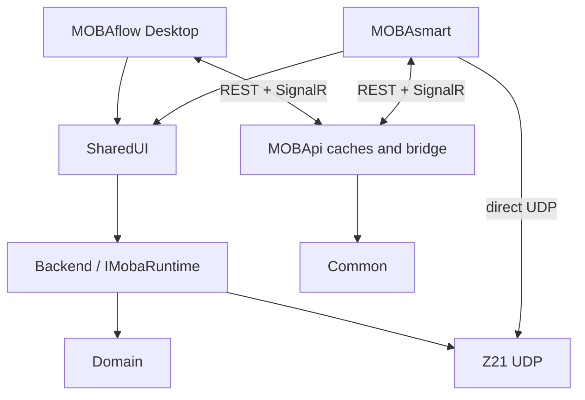

# MOBAflow Architecture

## 📐 System Overview

For the current repository-wide implementation reference, including pages,
models, workflow action support, display rendering, ESP32-S3 transport,
configuration files, build/deploy commands, and documentation findings, see
[`PROJECT-REFERENCE.md`](PROJECT-REFERENCE.md).

MOBAflow is built on **Clean Architecture** principles with a clear
separation of concerns:


```mermaid
flowchart TD
    WinUI["MOBAflow Desktop"] --> SharedUI
    MAUI["MOBAsmart"] --> SharedUI
    SharedUI --> Runtime["Backend / IMobaRuntime"]
    Runtime --> Domain
    Runtime --> Z21["Z21 UDP"]
    WinUI <-->|"REST + SignalR"| API["MOBApi caches and bridge"]
    MAUI <-->|"REST + SignalR"| API
    MAUI -->|"direct UDP"| Z21
    API --> Common
```

MOBApi is deliberately a thin standalone host that references `Common`, not
`SharedUI` or `Backend`. MOBAflow publishes the current solution and runtime
snapshots to it and consumes remote commands from it.

## 🏗️ Architecture Layers

### Track-plan dependency rule

Track-plan code follows an explicit inward dependency direction:

`TrackLibrary.Base contracts → TrackPlan.Renderer → platform adapters`

`TrackLibrary.PikoA` implements catalogue-specific geometry and may depend on
`TrackLibrary.Base`; the neutral renderer must never reference Piko A. Win2D
conversion stays in the Windows host. Runtime projection of EventBus feedback,
timers and railroad state belongs to `Backend/Service/TrackPlan`, not `SharedUI`.
`Test/TrackPlanRenderer/TrackLayoutArchitectureTests.cs` protects these rules.

### 1. **Domain Layer** (`Domain/`)

**Purpose:** Pure business logic, independent from UI or infrastructure.

**Content:**

- POCO Models (Solution, Journey, Workflow, FeedbackPoint, etc.)
- Domain Events & Aggregates
- Business Rules & Validation Logic

**Key Classes:**

The persisted domain uses mutable POCO classes such as `Solution`, `Project`,
`Journey`, `Station`, `Workflow` and `WorkflowAction`. Runtime snapshots are the
immutable boundary exposed to UI consumers.

**Characteristics:**

- ✅ **Framework-agnostic** - No dependencies on UI frameworks
- ✅ **Testable** - Unit tests without mocking UI
- ✅ **Reusable** - Shared across all platforms (MOBAflow, MOBAsmart)
- ✅ **Serializable** - JSON for configuration files

---

### 2. **Backend/Service Layer** (`Backend/`, `Common/`)

**Purpose:** Application services, coordination, external integrations.

**Content:**

- IZ21 (Z21 Control Station Communication)
- IMobaRuntime / MobaRuntimeService (authoritative runtime owner)
- WorkflowService (Action Execution)
- ActionExecutor (Action Implementation)
- `MasterDataStore` (shared cities/locomotives/multiplex master JSON, e.g. `data.json`)
- `ActiveProjectContext` (runtime project activation inside `MobaRuntimeService`)
- Runtime Snapshots (MobaRuntimeSnapshot, JourneyRuntimeSnapshot)
- Configuration & Settings Management
- Logging Infrastructure (Serilog)

**Key Interfaces:**

```csharp
public interface IZ21 : IZ21Connection, ILocoControl, IAccessoryControl, IZ21Diagnostics
{
}

public interface IMobaRuntime
{
    MobaRuntimeSnapshot Current { get; }
    Task ActivateProjectAsync(Project editableProject, CancellationToken cancellationToken = default);
    Task ConnectAsync(CancellationToken cancellationToken = default);
    Task SetTrackPowerAsync(bool isOn, CancellationToken cancellationToken = default);
}

public interface IActionExecutor
{
    Task ExecuteAsync(WorkflowAction action, ActionExecutionContext context);
}
```

**Characteristics:**

- ✅ **UDP Communication** - Direct Z21 protocol (no HTTP/REST dependencies)
- ✅ **Async-First** - All I/O operations use async/await
- ✅ **DI-Friendly** - Registered in ServiceCollection
- ✅ **Logging** - Structured logging with Serilog

---

### 3. **Presentation Layer** (`SharedUI/`)

**Purpose:** Shared ViewModels, MVVM infrastructure, cross-platform utilities.

**Content:**

- MainWindowViewModel (App State Management)
- Page-specific ViewModels (JourneyViewModel, WorkflowViewModel, etc.)
- ViewModels consume `IMobaRuntime` directly (no separate `IMobaClient` facade)
- MVVM Commands & Converters
- Observable Property Definitions

**Key Pattern:**

```csharp
// Shared ViewModel consuming runtime snapshots
public partial class MainWindowViewModel : ObservableObject
{
    private readonly IMobaRuntime _mobaRuntime;
    private readonly Solution _solution;

    [ObservableProperty]
    private bool isConnected;

    [RelayCommand]
    private async Task ConnectAsync()
    {
        await _mobaRuntime.ConnectAsync();
    }

    private void ApplyRuntimeSnapshot(MobaRuntimeSnapshot snapshot)
    {
        IsConnected = snapshot.IsConnected;
    }
}
```

**Characteristics:**

- ✅ **Platform-Agnostic** - Used by MOBAflow and MOBAsmart (MOBApi is a thin REST host with only `Common`)
- ✅ **MVVM Toolkit** - CommunityToolkit.Mvvm for source generators
- ✅ **Observable Properties** - Reactive UI updates
- ✅ **Commands** - RelayCommand for user interactions

---

### Runtime Boundary (Current Refactoring State)

The runtime split now covers the shared shell and the remaining
Z21-driven shared ViewModels:

```text
MainWindowViewModel / TrainControlViewModel / MauiViewModel
    ↓
IMobaRuntime (MobaRuntimeService)
    ↓
IZ21 / JourneyManager / WorkflowService
```

**Responsibilities of `IMobaRuntime` / `MobaRuntimeService`:**

- Owns Z21 connection state, auto-connect, disconnect and track power
- Owns active project execution via `ActiveProjectContext` and constructs
  `JourneyManager` when a project is activated
- Surfaces traffic monitor access, locomotive commands, multiplex signals,
  journey reset, and fail-safe / operator-ack state
- Publishes immutable runtime projections via `MobaRuntimeSnapshot`
  (system, journeys, locomotives) and raises `FeedbackReceived` for UI consumers
- Implementation is split into partial files under `Backend/Service/`
  (`RuntimeApi`, `Z21Handlers`, `AutoConnect`, and the core snapshot/constructor file)

**ViewModel wiring:**

- `MainWindowViewModel`, `TrainControlViewModel`, and `MauiViewModel` take
  `IMobaRuntime` from DI (WinUI / MAUI hosts register `MobaRuntimeService` as the
  singleton implementation)
- Journey-related UI still receives state from snapshots rather than owning
  `JourneyManager` directly

**Editor vs runtime state (done):**

- `MobaRuntimeService.ActivateProjectAsync` now executes against an **isolated deep
  copy** of the editor `Project` (`CloneForRuntime`, JSON round-trip via
  `JsonOptions.Compact`). Editor edits made after activation no longer leak into the
  running session, and runtime mutations never touch the live editor model.
- Entity Ids are preserved by the round-trip, so snapshots and journey reset keep
  resolving against the Ids the editor exposes.
- Covered by `Test/Backend/MobaRuntimeServiceProjectIsolationTests.cs`.

**Planned refactoring (`MainWindowViewModel` decomposition):**

- `MainWindowViewModel` is still a large aggregate (~18 partial files, ~17 ctor
  dependencies). The next maintainability step is extracting cohesive child
  ViewModels (e.g. a `SystemStatusViewModel` for speech-health / REST-API /
  post-startup status).
- This requires updating compile-time `x:Bind` bindings in WinUI and MAUI XAML, so
  it must be done and verified with the platform UI build (not part of the
  cross-platform subset).

---

#### Threading und UI-Thread-Grenze

**Warum gibt es überhaupt einen Dispatcher?**

- Backend und Dienste (Z21, Datei-I/O, Timer, Post-Startup) laufen auf **Hintergrund-Threads**.
- Das **EventBus** ruft Handler **auf dem Thread des Aufrufers** auf:
  `Publish` führt alle Subscriber synchron aus. Ruft also z. B. Z21
  aus einem Thread-Pool-Thread `Publish` auf, laufen die
  ViewModel-Handler auf diesem Hintergrund-Thread und ändern
  Observable-Properties → Verstöße gegen „UI-Updates nur auf dem
  UI-Thread“ und potenzielle COMException in WinUI.

**Saubere Architektur-Lösung:**

- **Eine zentrale Marshalling-Stelle:** Statt in jedem ViewModel
  `IUiDispatcher.InvokeOnUi` um jeden Event-Handler zu wickeln,
  marshalieren wir an der **EventBus-Grenze**. Ein
  `UiThreadEventBusDecorator` implementiert `IEventBus` und leitet
  `Publish` so weiter, dass alle Handler auf dem UI-Thread ausgeführt
  werden (über `IUiDispatcher.InvokeOnUi`). Dann müssen ViewModels für
  **EventBus-Subscriptions** den Dispatcher nicht mehr kennen.
- **Verbleibende Dispatcher-Nutzung:** Direkte Event-Quellen, die
  **nicht** über das EventBus laufen (z. B. `IZ21.Received`,
  `IZ21.OnConnectionLost`, async Datei-Lade-Completion,
  Post-Startup-Status), müssen weiterhin an einer Stelle auf den
  UI-Thread marshalieren – entweder in einem dünnen Adapter/Bridge,
  der nur dispatcht und dann das ViewModel aufruft, oder (derzeit) im
  ViewModel mit `IUiDispatcher`. Ziel ist, diese Fälle langfristig
  entweder über das EventBus zu führen (dann deckt der Decorator sie
  ab) oder in einem einzigen „UI-Bridge“-Service zu bündeln.

**MVVM-Konsequenz:**

- ViewModels sollen keine Thread-Logik enthalten; die Grenze
  „Hintergrund → UI“ gehört in eine **einzige** Schicht
  (EventBus-Decorator bzw. UI-Bridge). Dann bleibt der
  Dispatcher-Service eine technische Plattform-Detail-Implementierung,
  die an genau dieser Grenze verwendet wird, nicht in jedem ViewModel.

**Umsetzung (Stand):**

- **WinUI:** `AddEventBusWithUiDispatch()` bleibt fuer klassische
  UI-Events aktiv. `MainWindowViewModel` nutzt weiterhin EventBus-
  und View-basierte Statuspfade; `TrainControlViewModel` bezieht
  Z21-nahe Laufzeitdaten jetzt ueber `IMobaRuntime`-Snapshots und
  Runtime-Events statt direkt ueber EventBus-Subscriptions.
- **Verbleibende Dispatcher-Nutzung:** Dort, wo Snapshot-/Runtime-
  Events oder View-Callbacks außerhalb des UI-Threads ankommen:
  z. B. Datei-Lade-Callbacks (Solution laden),
  Health-Status-Updates aus der View (`MainWindow.xaml.cs`) und
  Runtime-Projection in `TrainControlViewModel`/`MauiViewModel`.
  Diese Fälle können später weiter in dedizierte UI-Bridges
  verschoben werden.

---

### 4. **Platform-Specific Layers** (`MOBAflow/`, `MOBAsmart/`, `MOBApi/`)

**Purpose:** UI rendering, platform-specific features, page and API definitions.

**MOBAflow (Windows Desktop, WinUI 3):**

```text
MOBAflow/
├── View/               # XAML Pages (MainWindow, JourneyPage, etc.)
├── ViewModel/          # WinUI-specific ViewModels
├── Service/            # WinUI Services (NavigationService, etc.)
├── Converter/          # XAML Value Converters
└── Resources/          # Styles, Brushes, Templates
```

**MOBAsmart (Android, .NET MAUI):**

```text
MOBAsmart/
├── View/               # XAML Pages (MainPage, etc.)
├── Resources/          # Styles, Colors, Fonts
├── Platforms/          # Platform-specific code (Permissions, etc.)
└── Service/            # MAUI Services
```

**MOBApi (REST API, ASP.NET Core):**

```text
MOBApi/
├── Controllers/        # REST API Controllers
├── Hubs/               # SignalR Hubs
└── Service/            # API Services
```

---

## 🔄 Data Flow

### Z21 Feedback Flow

```text
Z21 Station (UDP broadcast on Port 21105)
  ↓ (UDP packet)
IZ21.ReceiveFeedback()
  ↓
IMobaRuntime (MobaRuntimeService)
  ├─ JourneyManager processes feedback
  ├─ Runtime state is updated
  └─ MobaRuntimeSnapshot is published
  ↓
IMobaRuntime.SnapshotChanged
  ↓
MainWindowViewModel.ApplyRuntimeSnapshot()
  ↓
JourneyViewModel.UpdateFromRuntimeSnapshot()
  └─ MOBAflow/MOBAsmart re-render
```

### Command Execution Flow

```text
User clicks Button (MOBAflow/MOBAsmart)
  ↓
[RelayCommand] -> ViewModel Method
  ↓
IMobaRuntime (e.g. ConnectAsync, SetTrackPowerAsync, SetLocomotiveDriveAsync)
  ↓
IZ21 / JourneyManager / WorkflowService as appropriate
  ↓
ActionExecutor.ExecuteAsync() (workflow actions)
  ├─ Set Track Power
  ├─ Control Locomotive
  ├─ Play Sound
  └─ Speak Text
  ↓
IZ21 (UDP) or External Service
  ↓
Result -> UI State Update
  └─ ObservableProperty change
```

---

## 📦 Dependency Injection Container

The DI container (`Microsoft.Extensions.DependencyInjection`) is the
heart of the architecture:

### Registration Structure

```csharp
// App.xaml.cs / Program.cs
var services = new ServiceCollection();

// Domain/Backend Services
services.AddSingleton<Solution>();           // Domain
services.AddSingleton<MasterDataStore>();    // Master data (data.json)
services.AddSingleton<IZ21>(/* z21 impl */); // Backend Service
services.AddSingleton<IMobaRuntime, MobaRuntimeService>();
services.AddSingleton<IWorkflowService, WorkflowService>();

// Presentation Layer
services.AddSingleton<MainWindowViewModel>(); // Shared ViewModel
services.AddTransient<JourneyPage>();        // Platform-specific Pages

// Platform Services
services.AddSingleton<NavigationService>();  // WinUI Navigation
services.AddSingleton<IIoService, IoService>(); // File Operations

// Plugins
var pluginLoader = new PluginLoader(...);
pluginLoader.LoadPluginsAsync(services);      // Discover & Register

var provider = services.BuildServiceProvider();
```

### Resolution Example

```csharp
// Request: MainWindowViewModel
provider.GetRequiredService<MainWindowViewModel>()

// DI Container resolves:
MainWindowViewModel(
    IMobaRuntime mobaRuntime,    // → Singleton MobaRuntimeService
    IEventBus eventBus,          // → Singleton instance
    Solution solution,           // → Singleton instance
    ...
)
```

---

## 🛡️ Error Handling & Robustness

### Event bus (`IEventBus`)

- Handlers run sequentially per publish; one failing handler does **not** cancel
  the others.
- Failures are logged at **error** level; when a debugger is attached, an extra
  `Debug.WriteLine` aids local diagnosis (see `Common/Events/IEventBus.cs`).

### Recorder isolation boundary

- Live capture occurs in `RecordingEventBusDecorator` before UI dispatch and persists only explicitly mapped payloads.
- Replay never publishes recorded events to the root EventBus and never calls `IMobaRuntime` or `IZ21`.
- `RecordingReplayService` schedules journal entries against a freshly constructed, in-memory `IsolatedReplayRuntime`.
- The isolated runtime factory does not receive the production service provider or any external-effect adapter.
- A separate read-only safety gate blocks play, step, and seek while the production runtime reports an active Z21 connection and rechecks before each application.
- Pause cancels the current scheduled wait; seek and reset rebuild isolated state from position zero without changing production state.

### Graceful Degradation

```text
If Z21 Connection Fails:
  • App still starts
  • UI shows "Disconnected" status
  • Commands are disabled
  • No actions can execute
    
If DLL is corrupted:
  • Error logged
  • Next DLL is attempted
  • App always runs
```

### Logging Strategy

```text
Critical: App won't start
  └─ DI setup failure
  └─ Configuration corruption

Error: Feature won't work
  └─ Z21 connection lost
  └─ Plugin DLL corrupt

Warning: Unexpected but recoverable
  └─ Duplicate page tag in plugin
  └─ Missing configuration value

Info: Normal operations
  └─ Z21 connected
  └─ Plugin loaded
  └─ Command executed

Debug: Diagnostic info
  └─ Property changed
  └─ Event fired
  └─ Service method called
```

---

## 🔗 Layer Communication

### How Layers Interact

```text
User Input (UI Layer)
  ↓
ViewModel Command (Presentation Layer)
  ↓
Service Method (Backend Layer)
  ↓
Domain Model Logic (Domain Layer)
  ↓
External Integration (Z21 UDP)
  ↓
Result back up the stack
  ↓
Observable Property Update
  ↓
UI Re-renders
```

---

## 📊 Technology Decisions

- **UI:** WinUI 3 (MOBAflow), .NET MAUI (MOBAsmart)
  - **Why:** Native look & feel, platform-specific features
- **API:** ASP.NET Core REST + SignalR (MOBApi)
  - **Why:** Lightweight REST + real-time hub
- **MVVM:** CommunityToolkit.Mvvm
  - **Why:** Source generators, zero-reflection overhead
- **DI:** Microsoft.Extensions.DependencyInjection
  - **Why:** Standard .NET DI, no external dependencies
- **Logging:** Serilog
  - **Why:** Structured, extensible, file + in-memory sinks
- **Z21 Protocol:** UDP (direct)
  - **Why:** Low latency, no external dependencies
- **Testing:** NUnit
  - **Why:** Simple, focused unit tests

---

## MOBAsmart / MOBAflow runtime sync

MOBAsmart and MOBAflow coordinate through MOBApi (solution catalog, RuntimeHub snapshots,
remote commands). Z21 LAN broadcasts do not replace this layer because they carry DCC-level
state only. See [Z21-MOBAFLOW-SYNC.md](Z21-MOBAFLOW-SYNC.md) for the full decision record,
slim snapshot profile, and observability endpoints.

---

## 🚀 Future Extensibility

The architecture supports:

- ✅ **New UI Platforms** - Just implement UI layer above SharedUI
- ✅ **New Services** - Add to Backend, register in DI
- ✅ **New Plugins** - Drop DLL in Plugins folder
- ✅ **Protocol Upgrades** - Encapsulated in IZ21
- ✅ **Configuration Expansion** - AppSettings extensible
- ✅ **Domain Evolution** - Models can change independently

---

**Last Updated:** July 2026
