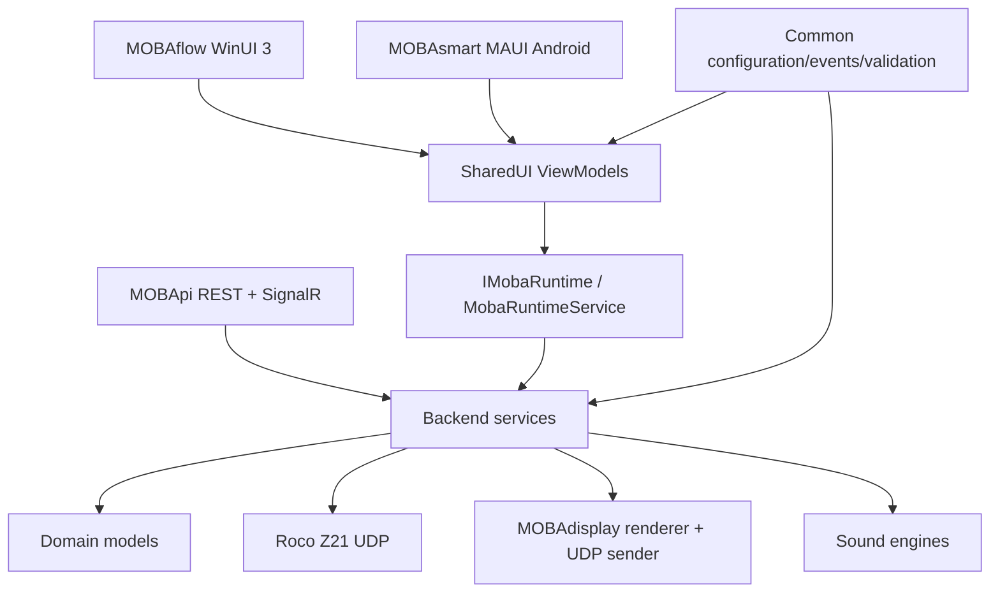
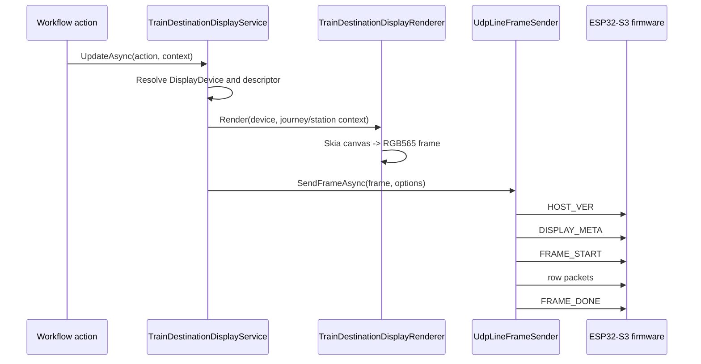

# MOBAflow Project Reference

**Scope:** current repository structure, runtime architecture, data models, workflows, display pipeline, firmware notes, configuration, build, deployment, and documentation findings.  
**Last updated:** May 2026

## Purpose

MOBAflow is an event-driven model railroad automation system built on .NET 10. It combines:

- **MOBAflow:** WinUI 3 desktop application for layout operation, editing, monitoring, train control, and configuration.
- **MOBAsmart:** Android MAUI companion app for mobile operation, discovery, photo upload, and status interaction.
- **MOBApi:** ASP.NET Core REST and SignalR host used by mobile clients and external integrations.
- **Backend/Common/Domain:** platform-independent runtime, data models, Z21 protocol, configuration, validation, and events.
- **MOBAdisplay:** SkiaSharp-based frame rendering and UDP transport for ESP32-S3-driven remote displays.

## Repository structure

```text
MOBAflow/
├─ Domain/                Core models, enums, JSON converters, workflow payloads
├─ Common/                Configuration, events, validation, discovery, plugins, path helpers
├─ Backend/               Z21 protocol, runtime service, workflow execution, journey managers
├─ SharedUI/              Cross-platform ViewModels, shell abstractions, UI services
├─ Sound/                 Speech engines, sound player abstractions, audio resources
├─ MOBAflow/              WinUI 3 desktop app, pages, controls, converters, appsettings, sample JSON
├─ MOBApi/                ASP.NET Core REST API and SignalR hub
├─ MOBAsmart/             Android MAUI app, mobile controls, and mobile services
├─ MOBAdisplay/           Display rendering, frame transport, ESP32 firmware prototype
├─ TrackLibrary.Base/     Track piece abstractions and shared geometry contracts
├─ TrackLibrary.PikoA/    Piko A-Gleis track library and snap helpers
├─ TrackPlan.Renderer/    Track plan SVG/rendering helpers
├─ Test/                  NUnit tests and analysis utilities
├─ docs/                  User, architecture, legal, security, and developer documentation
├─ .azure-pipelines/      Azure DevOps CI/release pipeline definitions
├─ .github/               Copilot instructions, issue templates, agents
└─ .windsurf/             Windsurf rules and local workflows
```

## Architecture overview

MOBAflow follows a layered architecture with platform-independent runtime logic below platform-specific UI/API hosts.



### Layer responsibilities

| Layer | Folder | Responsibility |
| --- | --- | --- |
| Domain | `Domain/` | Serializable POCO models, enums, workflow action payloads, train composition, display definitions. |
| Common | `Common/` | App settings, EventBus, validation, discovery protocol parser, plugin contracts, path helpers. |
| Backend | `Backend/` | Runtime orchestration, Z21 UDP protocol, journey feedback processing, workflows, display update service. |
| SharedUI | `SharedUI/` | MVVM state, commands, shell abstractions, cross-platform UI services. |
| Platform hosts | `MOBAflow/`, `MOBAsmart/`, `MOBApi/` | WinUI pages, Android UI, REST API, SignalR, OS-specific services. |
| Display | `MOBAdisplay/` | Skia rendering to RGB565 frames and UDP line transport to ESP32-S3 displays. |
| Track | `TrackLibrary.*`, `TrackPlan.Renderer/` | Track geometry, catalogues, snapping, rendering and export. |

## Runtime and threading model

The authoritative runtime is `IMobaRuntime`, implemented by the partial `MobaRuntimeService` in `Backend/Service/`.

Important files:

- `Backend/Interface/IMobaRuntime.cs`
- `Backend/Service/MobaRuntimeService.cs`
- `Backend/Service/MobaRuntimeService.RuntimeApi.cs`
- `Backend/Service/MobaRuntimeService.Z21Handlers.cs`
- `Backend/Service/MobaRuntimeService.AutoConnect.cs`
- `Backend/Service/MobaRuntimeService.StatusFormatting.cs`

Runtime responsibilities:

- Own Z21 connection state and auto-connect behavior.
- Activate the current `Project` and create the active `JourneyManager`.
- Publish runtime snapshots for UI consumption.
- Execute locomotive, turnout, signal, power, fail-safe, and journey reset commands.
- Bridge Z21 feedback into journey state and UI-facing projections.

Threading invariant:

```text
Z21/network/background services
  -> publish or raise runtime events
  -> UiThreadEventBusDecorator or UI bridge
  -> SharedUI ViewModels update observable properties on UI thread
```

ViewModels must not add ad-hoc dispatcher calls inside EventBus handlers. The EventBus decorator is the central marshalling boundary for EventBus traffic.

## Domain data model

### Solution and project

A `Solution` contains one or more `Project` instances. A project aggregates the editable model railroad data:

- Locomotives
- Passenger wagons
- Goods wagons
- Trains
- Workflows
- Journeys
- Stations and platforms
- Track plans
- Signal box plans
- Display devices

Sample data is stored in `MOBAflow/solution.json`. JSON serialization is configured via `Domain/JsonOptions.cs` and workflow action polymorphism is handled by `WorkflowActionJsonConverter`.

### Rolling stock and trains

Rolling stock is represented by `Locomotive`, `PassengerWagon`, and `GoodsWagon`. The canonical train composition model is `Train.Vehicles`:

```json
{
  "name": "RE 78",
  "vehicles": [
    { "vehicleId": "...", "vehicleKind": 0, "isReversed": false },
    { "vehicleId": "...", "vehicleKind": 1, "isReversed": false }
  ]
}
```

`VehicleKind` identifies whether an entry refers to a locomotive, passenger wagon, or goods wagon. The order is free and mixed, so a train can represent arbitrary consists rather than separate locomotive/wagon lists.

### Journeys, stations, and platforms

A `Journey` defines an ordered station list and feedback behavior. Important fields include:

- `Stations`: ordered stops.
- `Text`: announcement template.
- `InPort`: feedback input used to advance journey state.
- `FirstPos`: initial station index.
- `BehaviorOnLastStop`: stop, restart from first stop, or switch to another journey.
- `IsUsingTimerToIgnoreFeedbacks` and `IntervalForTimerToIgnoreFeedbacks`: duplicate feedback suppression.

Stations and platforms can reference workflows. Platform/station changes are managed by `StationManager` and `PlatformManager`; journey execution is managed by `JourneyManager`.

### Workflows and actions

Workflow action types are defined by `Domain/Enum/ActionType.cs`:

| Action type | Payload | Runtime behavior |
| --- | --- | --- |
| `Announcement` | `AnnouncementActionPayload` | Uses journey template text and current station context for TTS. |
| `Command` | `CommandActionPayload` | Sends raw Z21/DCC bytes, usually from `bytesBase64`. |
| `Audio` | `AudioActionPayload` | Plays a local audio file through the configured sound player. |
| `ExecutePowerShellScript` | `PowerShellActionPayload` | Reserved in the domain model; not currently executed by `ActionExecutor`. |
| `TrainDestinationDisplay` | `TrainDestinationDisplayActionPayload` | Updates an ESP32-S3 train destination display through `TrainDestinationDisplayService`. |

Current execution support in `ActionExecutor` covers `Command`, `Audio`, and `Announcement`. Display actions are implemented by `TrainDestinationDisplayService`; callers must wire them into execution paths deliberately. Unsupported action types raise `NotSupportedException` when sent directly to `ActionExecutor`.

Workflow execution is handled by `WorkflowService`:

- `Sequential`: actions execute ordered by `Number`, each awaited before the next action.
- `Parallel`: actions are started with cumulative `DelayAfterMs` offsets and awaited as a group.
- `WorkflowExecutionOptions.StopOnFirstActionFailure`: controls whether sequential execution rethrows the first action failure.
- `ActionExecutionError`: event for UI or monitoring layers to observe action failures.

### Display devices and layouts

Display configuration is persisted in the project model:

- `DisplayDevice`: physical target, IP address, UDP port, purpose, rotation, layout.
- `DisplayLayout`: target model, unrotated dimensions, rotation, label list.
- `DisplayLabelElement`: free-positioned label with type, size, font size, rotation, and visibility.

Supported display models:

| Display model | Purpose | Resolution | Controller note |
| --- | --- | --- | --- |
| `WaveshareLcd147Rounded172X320Spi` | Train destination display | 172 x 320 | ESP32-S3 minimum. |
| `Lcd169Rounded240X280IpsSpi` | Train destination display | 240 x 280 | ESP32-S3 minimum. |
| `RgbMatrix5X5Breakout` | Signal/turnout indicator | 5 x 5 | Reserved for signal/turnout indication. |

Supported rotations are `Rotate0`, `Rotate90`, `Rotate180`, and `Rotate270`. Rotation can be applied globally on the device/layout and per label.

## JourneyManager workflow

The core journey feedback flow is:

```text
Z21 feedback packet
  -> Z21FeedbackParser / Z21 event
  -> JourneyManager.ProcessFeedbackAsync
  -> match journey.InPort
  -> optional duplicate-feedback timer filter
  -> increment JourneySessionState.Counter
  -> publish FeedbackReceived
  -> compare counter with current station.NumberOfLapsToStop
  -> publish StationChanged when station is reached
  -> execute station workflow
  -> reset counter
  -> advance station position or apply BehaviorOnLastStop
```

Important classes:

- `JourneyFeedbackManagerBase`: shared feedback filtering and base behavior.
- `JourneyManager`: journey state, feedback processing, station workflow execution.
- `JourneySessionState`: runtime-only state separated from persisted domain models.
- `ActionExecutionContext`: context passed to workflow actions, including current project/journey/station and Z21/sound dependencies.

## Display rendering and ESP32-S3 communication

The display pipeline renders high-level journey/station data into RGB565 frames and sends them to an ESP32-S3 target over UDP.



### Frame format

- Pixel format: RGB565, 2 bytes per pixel.
- Frame size: `width * height * 2` bytes.
- Default 1.69 inch LCD: `240 * 280 * 2 = 134400` bytes.
- Transport port default: UDP `4210`.

### Current line-based UDP protocol

`UdpLineFrameSender` sends:

1. `HOST_VER:<assembly informational version>` once per endpoint.
2. `DISPLAY_META:<width>:<height>:<displayModel>:<rotation>` before each frame.
3. `FRAME_START`.
4. One UDP packet per display row:
   - first 2 bytes: row index, big-endian.
   - remaining bytes: complete RGB565 row data.
5. `FRAME_DONE`.

Legacy `FrameSender` still sends 1024-byte chunks and `FRAME_DONE`; the line-based sender is the richer protocol used by the runtime display service.

### Rendering details

- `TrainDestinationDisplayRenderer` creates a Skia `SKBitmap`, clears a dark background, applies global rotation, draws visible labels, and converts the bitmap to RGB565.
- `DisplayLabelValueResolver` maps semantic label types to values from `TrainDestinationDisplayRenderContext`.
- `ClockRenderer` renders a DB-style analog clock with fixed colors optimized for low-resolution RGB565 output.
- `GridRenderer` and `SkiaFrameRenderer` provide reusable frame rendering primitives.

### Firmware status

`MOBAdisplay/MobaDisplay/MobaDisplay.ino` is currently a minimal TFT_eSPI hardware smoke test that initializes the display and cycles red, green, blue, and white screens. It does not yet implement the documented UDP receive protocol. Production firmware still needs to receive `HOST_VER`, `DISPLAY_META`, row packets, and `FRAME_DONE`, assemble a framebuffer, and flush it to the TFT.

## MOBApi endpoints

`MOBApi` is a lightweight ASP.NET Core host. It maps controllers and a SignalR hub at `/photos-hub`.

| Endpoint | Method | Purpose |
| --- | --- | --- |
| `/api/photos/health` | GET | Photo API health check. |
| `/api/photos/upload` | POST multipart form | Uploads a photo, validates type and size, stores it, broadcasts `PhotoUploaded`. |
| `/api/status` | GET | Returns API status, port, and connected clients. |
| `/api/clients/register` | POST JSON | Registers a MAUI or external client. |
| `/api/clients/unregister` | POST JSON | Removes a client from the in-memory registry. |
| `/photos-hub` | SignalR | Push notifications for photo uploads. |

Photo upload details:

- Allowed file extensions: `.jpg`, `.jpeg`, `.png`, `.bmp`, `.gif`, `.webp`.
- Maximum upload size: 10 MB.
- Base directory: `MOBAFLOW_PHOTOS_PATH` if set, otherwise `Documents/MOBAflow/Photos`.
- Returned path format: `photos/<category>/<entityId>.<extension>`.

When `MOBAFLOW_DISCOVERY_IN_WINUI=1` is set, UDP discovery is expected to run inside the WinUI host instead of standalone MOBApi.

## WinUI pages and feature toggles

Current WinUI pages under `MOBAflow/View/` include:

| Page | Purpose |
| --- | --- |
| `OverviewPage` | Runtime overview and connected client status. |
| `SolutionPage` | Solution/project management and persisted model editing. |
| `JourneysPage` | Journey, station, city library, workflow library, and properties editing. |
| `WorkflowsPage` | Workflow and workflow action editing. |
| `TrackPlanPage` | Visual track plan editor with snapping and rendering. |
| `SignalBoxPage` | Signal/turnout control panel and Viessmann multiplex signal work. |
| `JourneyMapPage` | Journey visualization. |
| `MonitorPage` | Traffic/activity monitoring and diagnostics. |
| `LocomotivesPage` | Locomotive inventory. |
| `PassengerWagonPage` | Passenger wagon inventory. |
| `GoodsWagonPage` | Goods wagon inventory. |
| `TrainsPage` | Train consist composition from mixed vehicle libraries. |
| `TrainControlPage` | Z21 throttle, presets, timetable, speed/current displays, F0-F31 functions. |
| `DisplayPage` | ESP display targeting and rendering experiments. |
| `StationsPage` | Station-oriented editing. |
| `SettingsPage` | Application configuration. |
| `HelpPage`, `InfoPage` | Documentation and app information. |

Feature toggles are stored under `AppSettings.FeatureToggles` and registered in `FeatureToggleRegistry`. Each page has an availability boolean and many pages also have an optional label/badge property.

## Configuration files

### Global build configuration

| File | Purpose |
| --- | --- |
| `global.json` | Pins .NET SDK to `10.0.300-preview` with `latestFeature` roll-forward. |
| `Directory.Packages.props` | Central NuGet package versions. |
| `Directory.Build.props` | Common metadata, MinVer, language version, nullable, analyzer and release policies. |
| `Directory.Build.targets` | Build-wide SourceLink package reference. |
| `version.json` | Additional versioning metadata. |
| `Moba.slnx` | Solution file. |

### Application settings

Main app settings live in `MOBAflow/appsettings.json` and are represented by `Common/Configuration/AppSettings.cs`.

Important sections:

| Section | Selected options |
| --- | --- |
| `Logging` | Default, Microsoft, and Moba log levels. |
| `Z21` | `CurrentIpAddress`, `DefaultPort`, `AutoConnectRetryIntervalSeconds`, `SystemStatePollingIntervalSeconds`, `RecentIpAddresses`. |
| `RestApi` | `CurrentIpAddress`, `Port`, `RecentIpAddresses`. |
| `Speech` | Azure key/region, rate, volume, engine, voice, test message. |
| `Application` | theme options, auto-load last solution, auto-start API, photo storage path. |
| `Counter` | feedback point count, target lap count, timer filter, timer interval. |
| `HealthCheck` | health check enabled and interval. |
| `Display` | last ESP32 target IP. |
| `SignalBox` | polarity inversion per Viessmann multiplex address offset. |
| `Layout` | page/panel/splitter expansion and persisted width settings. |
| `FeatureToggles` | page availability and optional labels. |

`MOBAflow/appsettings.schema.json` validates the public JSON shape. If new settings are added to `AppSettings`, the schema and documentation should be updated together.

### Solution and model JSON

| File | Purpose |
| --- | --- |
| `MOBAflow/solution.json` | Sample persisted solution/project data. |
| `MOBAflow/data.json` | Master data loaded by `MasterDataStore`. |
| `MOBAflow/track-plan.json` | Track plan sample/persistence file. |
| `MOBAflow/Build/Schemas/*.schema.json` | JSON schemas used by build-time validation targets. |

## Build, test, and deployment

### Windows desktop app

```bash
dotnet restore MOBAflow/MOBAflow.csproj
dotnet build MOBAflow/MOBAflow.csproj
dotnet run --project MOBAflow/MOBAflow.csproj
```

### Cross-platform backend/API/test subset

```bash
dotnet restore Backend/Backend.csproj
dotnet build Backend/Backend.csproj
dotnet build MOBApi/MOBApi.csproj
dotnet test Test/Test.csproj
```

### Android MAUI app

```bash
dotnet build MOBAsmart/MOBAsmart.csproj -f net10.0-android
```

### Notes

- Solution-level restore can fail on systems without Windows/Android workloads. Prefer project-level restore/builds in CI and agent environments.
- WinUI requires Windows and Windows App SDK tooling.
- MAUI Android requires the Android workload/toolchain.
- Release builds treat warnings as errors.
- `FastDebug` disables analyzers for faster local iteration.

## Azure DevOps pipelines

The `.azure-pipelines/` folder contains:

- `quality.yml`: quality/test/coverage pipeline.
- `release.yml`: release pipeline.
- `templates/build.yml`: reusable build template.
- `templates/test.yml`: reusable test template.
- `variables/common-variables.yml`: shared pipeline variables.

Coverage is collected with dotnet coverage/Cobertura settings in `Test/dotnet-coverage.runsettings` or Coverlet via `Test/coverlet.runsettings`.

## Third-party and legal surface

MOBAflow is licensed under MIT. Direct package versions are centrally managed in `Directory.Packages.props` and summarized in `docs/THIRD-PARTY-NOTICES.md`.

Relevant third-party technology areas:

- Microsoft .NET, Windows App SDK, WinUI, ASP.NET Core, MAUI, Win2D.
- CommunityToolkit MVVM/WinUI/MAUI controls.
- Serilog logging packages.
- NUnit, Moq, Coverlet, Microsoft.NET.Test.Sdk.
- SkiaSharp for display rendering.
- Piper TTS and System.Speech.
- CommunityToolkit.Maui and AndroidX Startup for MOBAsmart.
- External interoperability with Roco Z21, Piko A-Gleis, AnyRail XML, ESP32-S3/TFT_eSPI hardware.

Before releases, run `dotnet list <project>.csproj package --include-transitive` for distributable projects and compare licenses against `docs/THIRD-PARTY-NOTICES.md`.

## Documentation findings and improvement backlog

The analysis found these documentation issues and recommended improvements:

| Area | Finding | Recommendation |
| --- | --- | --- |
| README screenshots | Train Control text still referenced F0-F20 while code supports F0-F31. | Updated to F0-F31. |
| Path names | Some documents still referenced old `WinUI/` paths. | Prefer actual `MOBAflow/` paths. |
| Third-party notices | Several package versions were stale compared with `Directory.Packages.props`. | Keep notices synchronized with central package management. |
| Display firmware | Protocol documentation implied firmware receive behavior, but `.ino` is only a TFT smoke test. | Document firmware implementation status explicitly. |
| JSON validation | Document mentioned `Common/Validation/JsonValidationService.cs`; current validation responsibilities should be checked against actual code before future edits. | Keep JSON validation docs tied to current owner files. |
| App settings schema | Schema does not list all `AppSettings` members such as `Layout`, `Display`, `SignalBox`, `TrainControl`, theme settings, and `SystemStatePollingIntervalSeconds`. | Extend schema when configuration compatibility is formalized. |
| Workflow actions | Domain includes `ExecutePowerShellScript` and `TrainDestinationDisplay`, while default `ActionExecutor` only handles command/audio/announcement. | Document execution support separately from domain payload availability. |
| Firmware protocol | Legacy chunk protocol and current row protocol coexist. | Prefer row protocol in new firmware and mark chunk sender as legacy. |
