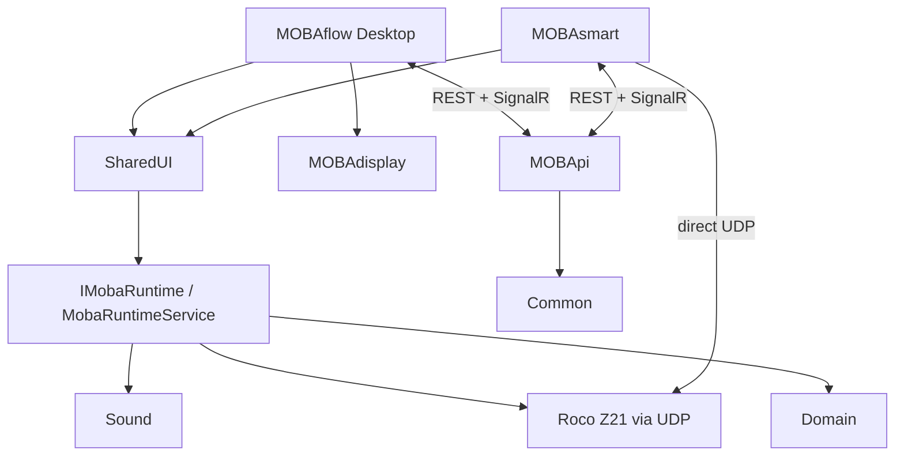

# MOBAflow project reference

**Scope:** current repository structure, app boundaries, runtime behavior,
persisted data, integrations and build entry points.
**Last reviewed:** 2026-07-20

## Products

| Product | Current role |
| --- | --- |
| **MOBAflow** | WinUI desktop host for editing, operating, monitoring, speech and display workflows |
| **MOBAsmart** | Android host with a local Z21 runtime plus optional MOBAflow/MOBApi synchronization |
| **MOBApi** | Standalone ASP.NET Core cache/bridge for solution data, runtime state, commands, progress, photos and clients |
| **MOBAdisplay** | Rendering/transport library referenced by MOBAflow plus working PlatformIO receiver firmware; end-to-end app integration remains preview-stage |

## Repository structure

```text
Domain/                 Persisted models, enums and JSON converters
Common/                 Configuration, events, validation, discovery and helpers
Backend/                Z21 protocol, runtime, journey and workflow services
SharedUI/               Cross-platform ViewModels and UI-facing services
Sound/                  Audio and speech abstractions/implementations
MOBAflow/               Windows WinUI app
MOBAsmart/              Android MAUI app
MOBApi/                 REST and SignalR host
MOBAdisplay/            RGB565 rendering, UDP transport and firmware prototypes
TrackLibrary.Base/      Shared track geometry contracts
TrackLibrary.PikoA/     Piko A catalog and editable track-plan implementation
TrackPlan.Renderer/     Platform-neutral render and SVG primitives
Test/                   NUnit test project
MutationTest/           Focused Stryker.NET lanes
docs/                   User, developer, legal and protocol documentation
plans/                  Standalone project, quality, refactoring and roadmap plans
.github/workflows/      Public quality, pages and release workflows
.azure-pipelines/       Additional Azure DevOps quality/release workflows
```

## Architecture



MOBApi intentionally references `Common` only. It does not host the Backend
runtime; MOBAflow publishes solution and runtime state into its caches and
consumes queued remote commands.

### Layer responsibilities

| Layer | Responsibility |
| --- | --- |
| `Domain` | Serializable models and workflow payloads without platform dependencies |
| `Common` | Configuration, EventBus contracts, validation, discovery and runtime DTOs |
| `Backend` | Runtime orchestration, Z21 communication, feedback, journeys and workflows |
| `SharedUI` | Observable state and commands shared by WinUI and MAUI |
| App hosts | Platform UI, lifecycle, files, network wiring and process management |

## Runtime and threading

`IMobaRuntime` is implemented by the partial `MobaRuntimeService`:

- `Backend/Service/MobaRuntimeService.cs`
- `Backend/Service/MobaRuntimeService.RuntimeApi.cs`
- `Backend/Service/MobaRuntimeService.Z21Handlers.cs`
- `Backend/Service/MobaRuntimeService.AutoConnect.cs`

The runtime owns Z21 state, project activation, journey sessions, feedback
projection and immutable snapshots. Runtime projects are cloned from the editor
graph so execution does not mutate the solution being edited.

EventBus traffic follows one UI marshalling boundary:

```text
Z21/background publisher
  -> EventBus
  -> UiThreadEventBusDecorator
  -> ViewModel handler on the UI thread
```

ViewModels must not add dispatcher calls inside EventBus handlers.

### MOBAsmart hybrid runtime

MOBAsmart owns a local `IMobaRuntime` for direct Z21 feedback and commands. It
also connects to `/runtime-hub` and the MOBApi REST surface:

- locomotive commands prefer the local Z21 when connected;
- remote commands are the fallback when the desktop runtime is active;
- signal-box/domain state prefers the active MOBAflow session; and
- cached solution/fleet/signal-box data is used while reconnecting.

`MobileRuntimeCoordinator`, `RuntimeHubRemoteClient`, `SolutionRemoteLoader` and
`MobileSolutionStore` implement this behavior.

## Persisted model

`Solution.CurrentSchemaVersion` is currently `4`. A solution contains projects;
each project can contain:

- locomotives, passenger wagons, goods wagons and train consists;
- locomotive maintenance plans, decoder snapshots and whistle rules;
- stations and platforms;
- workflows;
- journeys with ordered stations, an `IsActive` flag and a `JourneyEventPlan`;
- a `TrackPlanDocument`;
- a `SignalBoxPlan`;
- dated timetable services and their project-wide turnaround policy; and
- 5x5 matrix images.

The current sample is `MOBAflow/solution.json`. `MOBAflow/data.json` contains
shared master data loaded through `MasterDataStore`.

### Journeys and feedback

`InPortCounterService` counts accepted activations per InPort for the application
session; only an explicit reset sets the counters back to zero. A journey's
`EventPlan` holds independent `JourneyEvent` entries (InPort, count, optional
workflow, enabled). For every accepted activation, `JourneyManager` evaluates all
journeys marked `IsActive` and starts the workflow of each enabled event whose
InPort counter has just reached its count. Virtual stops change only through the
`ChangeJourneyStop` workflow action. Moving beyond the last stop leaves it unchanged.
There is no automatic completion, restart or follow-up journey. Counts without a
matching rule do nothing; the journey remains active. The current
stop is stored separately by `JourneyRuntimeStateStore` and exposed through
snapshots and MOBApi.

Timetable definitions remain part of the solution. Operator holds,
cancellations, actual times and live train/journey assignments are stored in a
separate project-scoped timetable session file. Runtime journey snapshots can
infer arrivals only when exactly one nonterminal service owns that journey;
departures remain manual dispatcher decisions.

The high-level flow is:

```text
Z21 feedback
  -> InPortCounterService (session count per InPort)
  -> JourneyManager (all active journeys)
  -> events whose InPort count matches
  -> workflow, optional ChangeJourneyStop
  -> publish snapshot and progress
```

## Workflows

A workflow stores an ordered `List<WorkflowAction>` and is reusable by multiple
event assignments through its stable ID. List order determines execution order;
`Number` is only the displayed ordinal. The workflow has no trigger or graph nodes.

`WorkflowValidator` checks workflow/action IDs, nonempty lists, typed payloads and
nonnegative `DelayAfterMs`. `WorkflowService` awaits each action and its delay,
propagates cancellation and stops at the first failure. It validates the selected
workflow independently of unrelated unfinished drafts.

`ActionExecutionContext` already provides project, journey, active session, stop,
platform and service dependencies. Its factory creates a separate context container
per invocation, including the triggering `IEvent` and event-definition ID. Later
actions see intentional stop updates in that invocation. The current Event Manager
supports feedback assignments; accepting generic event data does not add new subscriptions.
`WorkflowExecutionCoordinator` retains its FIFO and cancellation responsibilities.

Dry-run uses `WorkflowEffectPlanner`; it never calls an
`IWorkflowActionHandler`, waits for a delay, or performs network, hardware,
audio, script, display, filesystem-script, or mutable journey effects. Live
execution dispatches actions through `ActionExecutor` to typed handlers:

| Action type | Current runtime behavior |
| --- | --- |
| `Announcement` | Generate station-aware text and speak it locally |
| `Audio` | Play a local WAV file |
| `Command` | Send configured raw command bytes to the Z21 |
| `ExecuteScript` | Execute a PowerShell script with arguments |
| `SelectSignalAspect` | Resolve and send the configured multiplex signal command |
| `TrainDestinationDisplay` | Registered, but currently logs/skips when no display service is configured |
| `ChangeJourneyStop` | Move the active journey to the next or selected station |
| `Matrix` | Persisted enum value; no handler is registered |

Every run publishes correlated `WorkflowLifecycleEvent` records with source,
execution, optional parent, workflow and step IDs; mode; monotonic sequence;
attempt; timestamp; elapsed duration; and sanitized result/detail. The
in-memory `WorkflowTraceStore` retains at most 100 executions and 10,000 entries
by default. Trace persistence is deliberately outside `solution.json`.

EventManagerPage and WorkflowsPage use the same `WorkflowLibraryViewModel` and
the authoritative wrappers from `ProjectViewModel.Workflows`. EventManagerPage
shows compact event rows, a searchable workflow Values panel and selected
event Properties. It toggles the journey's active flag, resets the InPort
counters and supports workflow assignment and event move/copy with undo/redo.
Events stay editable while a journey is active; each change is re-applied to the
runtime. WorkflowsPage owns workflow authoring,
validation, dry-run and trace; both pages share the library and autosave state.
The workflow editor provides typed action settings, reordering, and duplication.
Deleting a workflow is blocked while any journey event references it.

The graph executor and graph authoring controls have been removed. Earlier graph
metadata/IDs remain readable, but actions are empty and execution is rejected until
the operator recreates the workflow. There is no automatic flattening or parallel
legacy executor. The existing lifecycle field `StepId` now holds the action ID.
See [issue #132](https://github.com/ahuelsmann/MOBAflow/issues/132).

## Track plan

`Domain.TrackPlanDocument` is the persisted neutral format.
`TrackPlanDocumentMapper` maps it to the editable Piko A representation.
`TrackPlanSolutionBinder` keeps the selected project and editor synchronized.

The dependency direction is:

```text
TrackLibrary.Base -> TrackPlan.Renderer
TrackLibrary.PikoA -> adapters/editor
MOBAflow -> Win2D input and drawing
```

Vendor-specific geometry must not be added to the neutral renderer.

## Display pipeline

The display library renders labels and clocks into RGB565 frames. The registered
`UdpDisplayFrameSender` opens a `DisplayProtocolFrameSession`, negotiates device
capabilities and sends each frame as one atomic version-1 transaction.
`UdpDisplayDeviceClient` owns the interactive diagnostic session used by the
desktop Display page.

```text
Display configuration
  -> SkiaFrameRenderer / ClockRenderer
  -> RGB565 big-endian frame
  -> Hello / BeginFrame / FrameRegion(s) / CompleteFrame
  -> versioned UDP datagrams
  -> ESP32-S3 target
```

The session validates dimensions, pixel format, rotation and atomic-frame
capabilities before sending frame data. Regions respect the negotiated payload
limit and carry packet ordering metadata; completion is accepted only after the
firmware has assembled and CRC-validated the full frame. See
`MOBAdisplay/docs/protocol.md`. MOBAflow stores one explicit IP address and UDP
port in user settings. The Display page validates that endpoint, negotiates live
capabilities, reports health, and gates test and optional commands against the
current session. It does not persist capabilities, identities, session IDs, or
credentials. No production destination-display workflow service is wired into
the default action handler yet.

`MOBAdisplay/esp32/src/main.cpp` implements the current 240x280 receiver: Wi-Fi
setup/status endpoints, a length-safe version-1 parser, bounded replay
protection, `FrameAssembler` staging and atomic TFT presentation.
`MOBAdisplay/MobaDisplay/MobaDisplay.ino` is an older standalone color-test
sketch and does not implement networking.

## MOBApi endpoints

MOBApi maps controllers plus two SignalR hubs.

| Route | Purpose |
| --- | --- |
| `GET /api/status` | API/runtime host status and clients |
| `GET/PUT /api/solution` | Current solution cache |
| `GET /api/solution/meta` | Solution metadata |
| `GET/PUT /api/runtime-settings` | Z21/runtime settings shared by the desktop host |
| `GET /api/runtime/meta` | Runtime cache metadata |
| `GET/PUT /api/runtime/snapshot` | Current runtime snapshot |
| `POST /api/runtime/commands/signal-aspect` | Queue/forward a signal command |
| `POST /api/runtime/commands/locomotive/drive` | Queue/forward a drive command |
| `POST /api/runtime/commands/locomotive/function` | Queue/forward a function command |
| `GET /api/runtime/commands/pending` | Consume pending commands |
| `GET /api/runtime/journeys/{id}/feedback-progress` | Read journey progress |
| `POST /api/runtime/journeys/{id}/feedback-progress/reset` | Reset journey progress |
| `POST /api/clients/register` | Register a client |
| `POST /api/clients/unregister` | Unregister a client |
| `GET /api/photos/health` | Photo service health |
| `GET /api/photos/file` | Serve a stored photo |
| `POST /api/photos/upload` | Store a photo and notify clients |
| `/runtime-hub` | Live runtime and solution notifications |
| `/photos-hub` | Photo notifications |

The default HTTP port is `5001`. `UdpDiscoveryService` runs in standalone MOBApi
unless `MOBAFLOW_DISCOVERY_IN_WINUI` indicates that the WinUI host owns
discovery. Version 2 discovery also advertises the persistent server identity,
LAN HTTPS endpoint and SHA-256 public-key fingerprint. The desktop host uses a
protected bootstrap channel, and MOBAsmart provides explicit fingerprint
verification and pairing. Authenticated remote reads and unified command
admission remain incomplete, so the compatibility HTTP path still exists.

MOBAflow starts MOBApi from an isolated copy of its build output so updates and
cleanup do not race the running process.

## App surfaces

### MOBAflow navigation

The current page registration includes Overview, Solution, Locomotives,
Passenger Wagons, Goods Wagons, Trains, Workflows, Stations, Journeys, Timetable, Event
Manager, Journey Map, Train Control, Track Plan, Signal Box, Display
Configurations, Matrix Images, Monitor, Help, Info and Settings.

Page availability and Preview labels are controlled by
`AppSettings.FeatureToggles` and `FeatureToggleRegistry`.

### MOBAsmart tabs

MOBAsmart exposes Counter, SignalBox, Engines and Control. The pages are mounted
lazily by `AppTabHostPage` to reduce startup work.

## Configuration

| File | Role |
| --- | --- |
| `global.json` | Required .NET SDK feature band |
| `Directory.Packages.props` | Central package versions |
| `Directory.Build.props` / `.targets` | Shared build policy |
| `version.json` | MinVer settings |
| `MOBAflow/appsettings.json` | Shipped desktop defaults |
| `MOBAflow/appsettings.schema.json` | Settings schema |
| `MOBAflow/Build/Schemas/*.schema.json` | Build-time data schemas |

Important application sections are `Z21`, `RestApi`, `Speech`, `Application`,
`Counter`, `HealthCheck`, `Display`, `SignalBox`, `TrainControl`, `Layout` and
`FeatureToggles`.

## Build and test entry points

```powershell
dotnet build MOBAflow/MOBAflow.csproj
dotnet restore MOBAsmart/MOBAsmart.csproj
dotnet build MOBAsmart/MOBAsmart.csproj --framework net10.0-android
dotnet build MOBApi/MOBApi.csproj
dotnet test Test/Test.csproj
```

The WinUI project requires Windows tooling and MOBAsmart requires the Android
MAUI workload. Cross-platform projects and most tests can be built separately.
See `docs/BUILD-PERFORMANCE.md` for the clean Android Release AAB workflow,
fast local configurations, and coverage commands. For `dotnet restore`, `-f`
means `--force`; use `--framework` with `dotnet build` or `dotnet publish` when
framework selection is required.

Public checks are defined in `.github/workflows/`; additional Azure DevOps
pipelines remain under `.azure-pipelines/`.

## Legal and third-party surface

MOBAflow is MIT licensed. Direct package versions are managed centrally and
their license surface is summarized in `docs/THIRD-PARTY-NOTICES.md`. External
product names such as Roco Z21, Piko A, AnyRail and ESP32 identify compatibility
only; MOBAflow is independent from their vendors.
